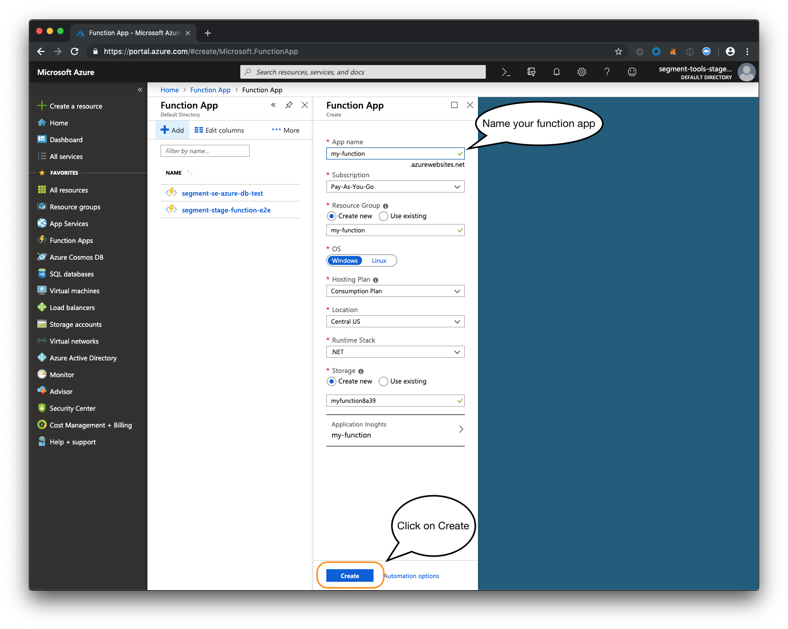
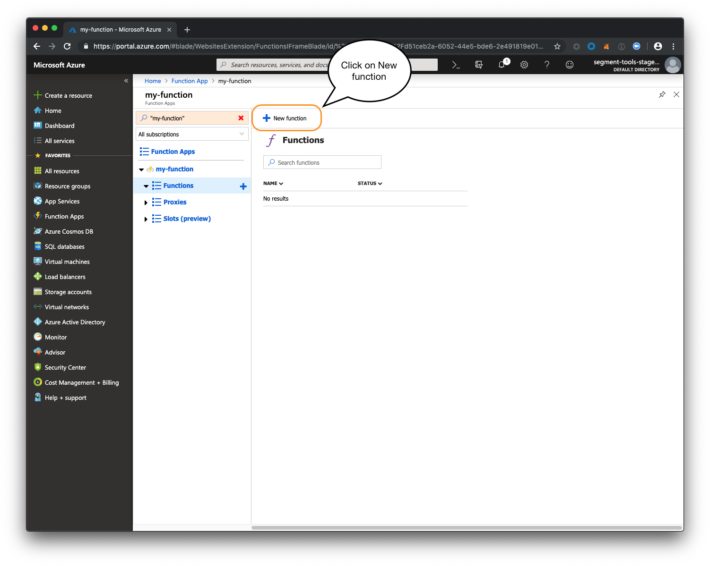
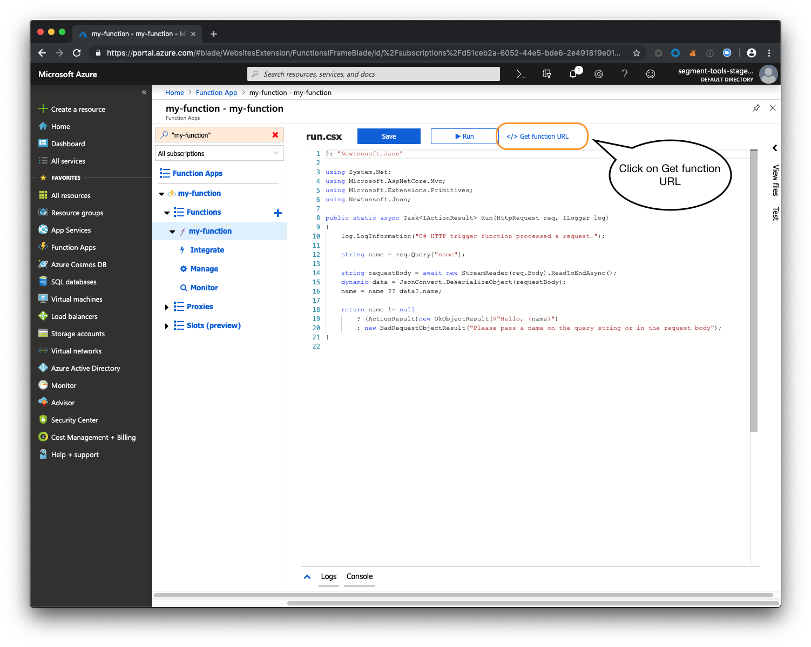

Segment makes it easy to send your data to Azure Function (and lots of other destinations). Once you've tracked your data through our open source [libraries](https://segment.com/libraries) we'll translate and route your data to Azure Function in the format they understand. [Learn more about how to use Azure Function with Segment.](https://segment.com/integrations/azure-function)

[Azure Function](https://azure.microsoft.com/en-us/services/functions) is a serverless compute service that enables you to run code on-demand without having to explicitly provision or manage infrastructure. Use Azure Functions to run a script or piece of code in response to a variety of events.

_**NOTE:** Azure Function is currently in beta, and this doc was last updated on May 6, 2019. This means that there may still be some bugs for us to iron out and we're excited to hear your thoughts. If you are interested in joining or have any feedback to help us improve the {{integration.name}} Destination and its documentation, please [let us know](https://segment.com/help/contact)!_

# Getting Started

{{>connection-modes}}

## Build an Azure Function to Process Segment Events

In order to process events from Segment, you will need to provide a Azure Function that can handle your event flow:

- Go to https://portal.azure.com.
- Click on `Functions App`.

- Click on `+Add` to create your Function App.

- In the `App name` field, name your app.
- Configure the other fields with your own flavor.
- Click on the `Create` button.

- Once your function app is created, click on its name (you may have to refresh the list by clicking on the `Refresh` button. 

- On the left pane, click on the `Functions` button.

- In the main frame, click on `New function`.

- Click on `HTTP trigger`.

- In the `Name` field, name your function.
- In `Authorization level` field, chose `Function`.
- Click on the `Create` button.

- Setup your function code.
- In the created function screen, click on `</> Get function URL`.

- In the `Key` field, if not already selected, select `default (Function key)`.
- Click on the `Copy` button in order to copy the URL. Keep this URL in order to later setup the Azure Function Segment destination.

## Configure Azure Function Destination

Once the Azure Function is created, a destination that will call the function must be configured:

- In our `Destinations` section, click on `Add Destination`. You will be redirected to our `Catalog`.
- Search and client on `Azure Function` destination.
- Click on `Configure Azure Function`.
- Fill the settings.

**Settings:**

| **HTTP Trigger** | The URL copied from  `</> Get function URL` button in the Azure function code screen. |

