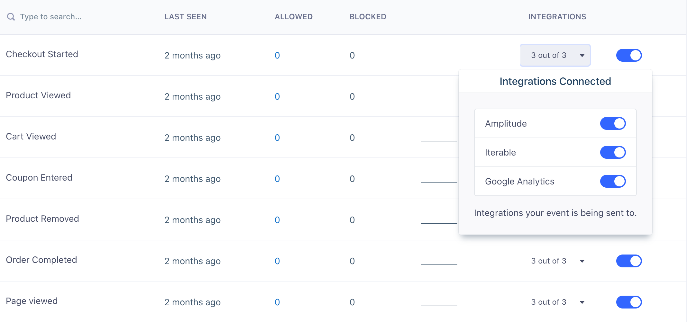

Once you have enabled Destinations for a given Source, all of the [data](/docs/connections/spec/) you track will be routed to your connected tools and warehouses. If you no longer wish to send all data to a particular Destination, you can disable the Destination from the Source overview page. 

But what happens when you want to send all of your data to a warehouse, and only two specific events to an analytics tool? And once you're satisfied with your spec, how do you make sure rogue events are blocked from all of your warehouses and end tools? Segment gives you the power to control exactly what data is allowed into your Destinations, so you can protect the integrity of your data, and the decisions you make with it.


## How do I filter specific events from being sent to specific Destinations?

An `integrations object` may be passed in the `options` of  `group`, `identify`, `page` and `track` methods, allowing selective Destination filtering. By default all Destinations are enabled.

All customers can filter specific events from being sent to specific Destinations (except for warehouses) by updating their tracking code. Here is an example showing how to send a single message only to Intercom and Google Analytics:

```js
analytics.identify('user_123', {
  email: 'jane.kim@example.com',
  name: 'Jane Kim'
}, {
  integrations: {
    'All': true,
    'Intercom': true,
    'Google Analytics': true,
    'Mixpanel': false
  }
});
```

Destination flags are **case sensitive** and match [the Destination's name in the docs](/docs/connections/destinations/catalog/) (for example, "AdLearn Open Platform", "awe.sm", "MailChimp", etc.).

If you're on Segment's Business plan, you can filter track calls right from the Segment UI on your Source Schema page by clicking on the field in the "Integrations" column and then adjusting the toggle for each tool. Segment recommends using the UI if possible since it's a much simpler way of managing your filters and can be updated with no code changes on your side.



## How do I block or disable specific events and properties from being sent to all Destinations?

If you no longer want to track an event, you can either remove it from your code or, if you're on the Business plan, you can block track calls right from the Segment UI on your Source Schema page by adjusting the toggle for each event.


Once you block an event in Segment, Segment stops forwarding it to all of your Destinations, including your warehouses. You can remove it from your code at your leisure. In addition to blocking track calls, Business plan customers can block all Page and Screen calls, as well as Identify traits and Group properties. 

## Export your Source Schema

Segment allows users with Source Read-only permissions to download Source Schemas as a CSV file, maximizing portability and access to event data. You can download a copy of your schema by visiting the Source Schema page. 

> success ""
> You can export Track, Identify, and Group Source Schemas.

### Download a CSV

To download a Source Schema CSV file: 
1. Sign into Segment and select a source.
2. Click the **Schema** tab in the source header.
3. On the Source Schema page, select a schema type (Track, Identify, or Group)
4. Click the **Download CSV** button. <br/> A toast pops up on the top of the page, with the message *"Your file is processing. When your file is ready it will be available to download from the Download History page."* 
5. Open the Download History page by clicking the link in the toast or following the instructions in the [view download history](#view-download-history) section.
6. Once the file status column indicates that the download was successful, click the **Download CSV** link to download your CSV to your computer.<br/> The Source Schema CSV name has the following format:<br/>`workspace-slug-source-slug-schema-type-yyyy-mm-dd-hh-mm`

> note "All events and properties are now included in the CSV file"
> When you exporting the Source Schema, all events and properties are included in the CSV file regardless of the filters or search parameters currently applied to the Source Schema view. 

### View download history

You can view the last 14 days' worth of Source Schema exports on the Download History page. 

To access the Download History page:
1. Sign into Segment and select a source.
2. Click the **Schema** tab in the source header.
3. Click the **View Download History** link.

### Track event CSV format
The Track event CSV file contains the following columns:
- Event Name
- Last Seen At (UTC)
  - If greater than 30 days, the value is "more than 30 days ago"
- Property Name
- Allowed
- Blocked
- Total
- Planned (available for Protocols customers with a connected Tracking Plan)
  - Values are "planned" or "unplanned"

> note "Labels in your exported CSV"
> If you use [labels](docs/protocols/tracking-plan/create/#add-a-label), they appear as columns in your CSV. The column headers are keys, and the column data contains values.

### Identity and Group event CSV format
The Identify and Group CSV files contain the following columns:
- Trait Name
- Last Seen At (UTC)
  - If greater than 30 days, the value is "more than 30 days ago"
- Allowed
- Blocked
- Total
- Planned (available for Protocols customers with a connected Tracking Plan)
  - Values are "planned" or "unplanned"

> info ""
> The exported schema doesn't include actual values (for example, personal data) for the events, properties, and traits you are tracking for a specific source.

See the [Segment Schema Limits](/docs/connections/schema-unique-limits/) for more information on how to manage the Source Schema. 
