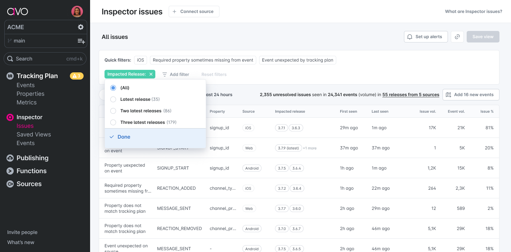
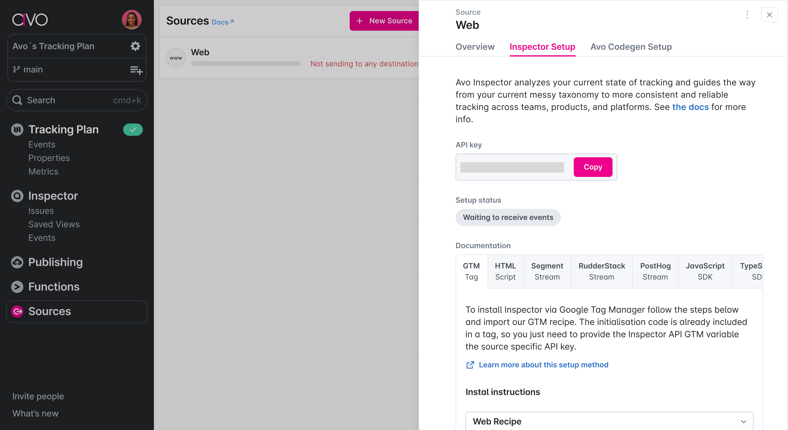

With [Avo](https://avo.app){:target="_blank”} Inspector, data quality is no longer a dream, it’s a workflow.

[Inspector](https://www.avo.app/data-observability){:target="_blank”} lets you find, triage, fix, and prevent data quality issues in your product analytics. Launch Inspector to discover all your data quality issues and systematically work towards better data, one resolved issue at a time.

The Avo Inspector destination automatically extracts event schemas from your product events, sending only the signatures from the connected Segment sources to the Inspector API. **Avo Inspector receives no PII data from your source**.



<!-- This template is meant for Actions-based destinations that do not have an existing Classic or non-Actions-based version. For Actions Destinations that are a new version of a classic destination, see the doc-template-update.md template. -->



<!-- Include a brief description of the destination here, along with a link to your website. -->

<!-- This include describes the requirement of A.js 2.0 or higher for Actions compatibility, and is required if your destination has a web component. -->

<!-- The section below explains how to enable and configure the destination. Include any configuration steps not captured below. For example, obtaining an API key from your platform and any configuration steps required to connect to the destination. →

### Track events

Currently the Integration only receives `Track` events.

Example of track call:

```js
analytics.track("Login", {
  userName: "John",
  city: "San Fransisco"
  age: 32
});
```

This track call is translated into a event signature that is sent to the inspector API

```js
{
  "eventName": "Login",
  "properties": [
    {"userName": "string"},
    {"city": "string"}
    {"age": "integer"}
  ]
}
```


## Getting started

1. From the Segment web app, click **Catalog**, then click **Destinations**.
2. Find the Destinations Actions item in the left navigation, and click it.
3. Click **Configure Avo**.
4. Select a source to connect to **Avo** (Actions).

<!-- The line below renders a table of connection settings (if applicable), Pre-built Mappings, and available actions. -->



<!--
Additional Context

Include additional information that you think will be useful to the user here. For information that is specific to an individual mapping, please add that as a comment so that the Segment docs team can include it in the auto-generated content for that mapping.
-->

## Destination Settings

1. Copy the **API Key** from Avo into the field `API Key` in settings.

2. Select an environment you'd like the data to go to within Avo. It should reflect from what environment the source is receiving data from. (**Production** / **Development** / **Staging**)
3. **(Optional):** If you have an event property describing the app release version of your source you can provide it under App Version. By default the destination attempts to extract your app release version from `{context.app.version}` which defaults to `unversioned` if that does not exist. Having accurate app release versions in Avo Inspector will help you identify which releases an issue is impacting, and monitor for regressions in future releases after you’ve resolved the issue.

## Getting Avo API key

Before connecting the segment source to Avo, you will need an api key for your source.

1. Create your Avo workspace at avo.app (If you don’t have one already)

2. From the Avo workspace sidebar, select **Sources**.
3. Select an existing source or create a new one. (We recommend naming your Avo sources the same as your Segment sources, for example "Web", "IOS", "Android")
   
4. Press the **Inspector Setup** tab inside the Avo source
5. Copy the API Key
   
