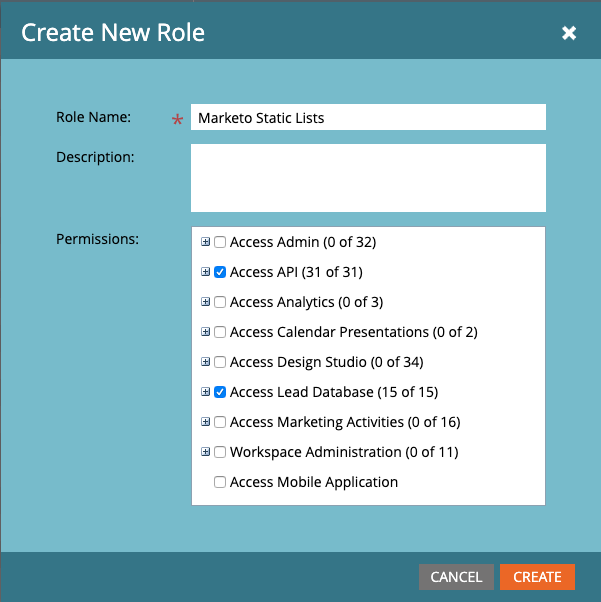
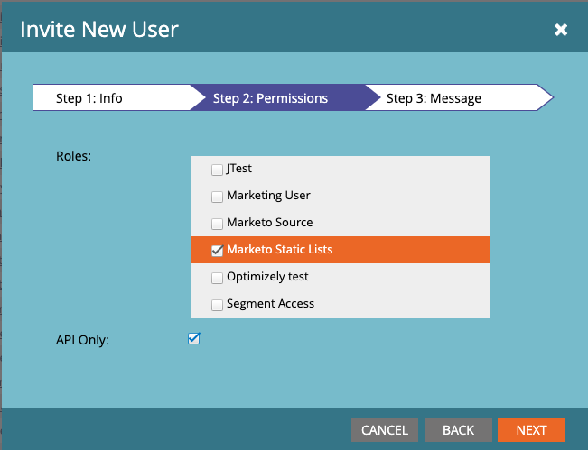
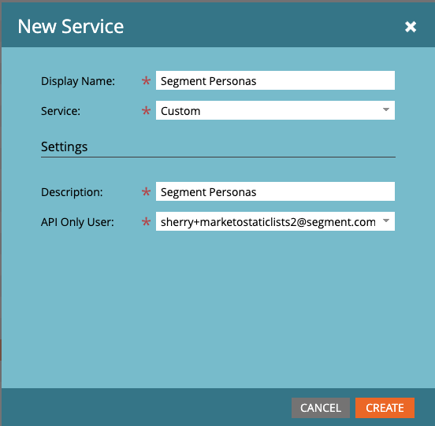

> info "Marketo Static Lists vs Marketo Static Lists (Actions) Destinations"

Marketo Static Lists (Actions) is a rebuild of the classic destination that provides the following benefits:

- **Simple setup** - Marketo Static Lists (Actions) has a streamlined default setup process making it easier to get started in a way that "just works".
- **More control** - Actions-based destinations enable you to define the mapping between the data Segment receives from your sources, and the data Segment sends to Marketo.
- **Default property mappings** - Default mappings from the Segment like event, timestamp, and more, allow data to be mapped correctly without any setup required.

## Overview

The Marketo Static Lists (Actions) destination lets you sync audiences created using [Engage](/docs/engage) into Marketo as a **List**. Once you create the audience, Segment sends that list of users to Marketo, and keeps it up to date as users enter and exit the audience specification.

This allows you to run email campaigns in Marketo without having to manually find and upload a refreshed csv of users. This documentation explains how to set up Marketo in Segment, and what to expect in your Marketo UI.

## Details

- **Supports Engage**: Yes
- **Engage Destination type**: List
- **Must create audience_name field before Engage can update those values?**: No. You don't need to create the _list_ in Marketo, however you do need to create the folder Segment will create the list in.
- **Audience appears as**: A list in the folder you created, in the Marketo Lead Database under Group Lists.
- **Destination rate limit**: 100 calls per 20 seconds, which is shared among all third-party API services
- **Lookback window allowed**: Yes
- **Identifiers required**: Email
- **Identifiers accepted**: Email
- **Client or Server-Side Connection**: Server-side

## How it works

Every time you create an audience in Engage and connect it to Marketo Static Lists, Segment does the following:

1. Creates a list with the same name as the Engage audience in the folder designated for Engage.
2. Adds any users to that list who both fit the audience definition and have an email address.
3. If a user has multiple email addresses on their identity graph, each email address becomes a unique entry on the list.
4. After the audience is configured, Segment checks which users still fit the audience definition, and adds or removes users from the audience.


## Configuring Marketo Static Lists

> success "Good to know:"
> To set up Marketo to receive Engage data, you need Marketo administrator access. If you don't have that access, work with the administrator for your organization.

### Step 1: Create an API-Only Marketo user

In this step, you'll create an API-Only Marketo user with both Access API and Lead Database access.

1. You can use an existing role with these permissions, or create a new role that has both Access API and Access Lead Database permissions. (Do this in Marketo by going to **Admin**→ **Users & Roles** → **Roles**).

   

2. Go to **Admin**→ **Users & Roles** → **Users** → **Invite New User** and create a new **API Only user** with the role that has both Access API and Lead Database permissions. **Be sure to check the API Only box.**

   

### Step 2: Create a Marketo Launchpoint Service for Engage

1. Go to **Admin** → **Integration**→ **LaunchPoint** → **New**
2. Create a new service. In the Service field, select `Custom`, and in the **API Only User** field, select the user you created in step 1.
3. Write down the **Client Id** and **Client Secret** for this service, as you will need it in Step 4.

### Step 3: Create a Marketo Lead Database folder and get your Marketo Endpoint

1. Go to your Marketo Lead Database and create a new folder under Group Lists. Once connected, each Engage audience shows up as a list in this folder.

   

2. Before you continue to the next step, in Marketo, go to **Admin → Web Services**, and copy or write down the REST API Endpoint. **Be sure to copy the REST endpoint and not the SOAP endpoint.** You'll need that in the next step.

> warning "Warning:"
> Do not create a list in the folder for the audience. Segment creates the list for you!

### Step 4: Set up the Marketo Static Lists (Actions) destination in Engage

1. From your Segment workspace, go to **Engage → Engage Settings → Destinations→ Add Destination** and then Search for Marketo Static Lists (Actions).
2. In the destination settings, enter the **Client Id**, **Client Secret**, **Endpoint** and **Folder Name** from the LaunchPoint service and folder you created in Steps 2 and 3. For **Endpoint**, note the Endpoint from Step 3.
3. Click the toggle to enable the Marketo Static Lists (Actions) destination.
4. Navigate to the **Mappings** tab, click **Add Mapping** and select **Add to List**. 
6. Click **Save** and make sure to enable the mapping. 
7. On the **Mappings** tab, click **Add Mapping** and select **Remove from List**. 
8. Click **Save** and make sure you enable the mapping. 

### Step 5: Create Engage audiences and add Marketo Static Lists as a destination

1. Navigate to the Engage Audiences tab and create a new audience.
2. Give your audience a name, some event and trait criteria, then click **Preview**.
3. Select Marketo Static Lists as a destination for the Audience.
4. In the settings that appear in the side panel, toggle the **Send Track** option on, and don't change the **Audience Entered/Audience Exited** event names.
12. Click **Save Settings**.

> info ""
> Only users with an email address appear in the list in Marketo. Users with multiple email addresses as external ids appear in the list once for each email address.

You can view the audience in Marketo by going to **Lead Database→ Group Lists→Name of folder you created in Step 3 → Audience name**

## Troubleshooting

#### Not seeing an audience in Marketo

Check that you followed all of the set-up steps.

Wait six or more hours after setup for your audience to start appearing in Marketo.

Check that you didn't create a list in the folder for the audience - Segment creates the list for you, and an existing one can conflict.

Check that the audience members you expect have an email address on their profile.

#### Audience size is smaller than expected
Only users in the audience who also have an email address are uploaded to the list.

You might need to adjust your query to filter out users without an email so you can get a better estimate of how many users will appear on the list. In the example below, we added an AND condition where users have a Custom trait of `email` which `exists`.

If a user has multiple email addresses, each address appears once in the Marketo lists. 
