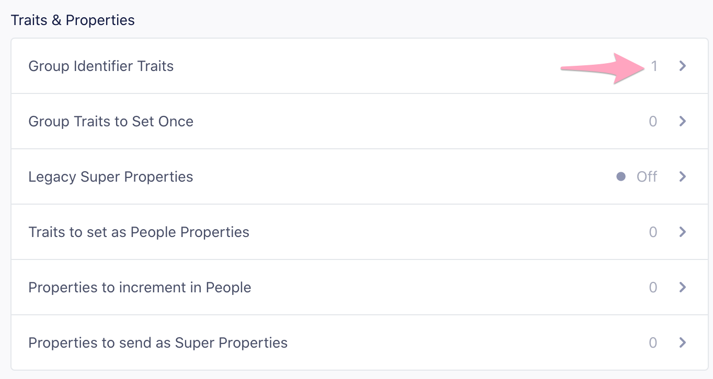
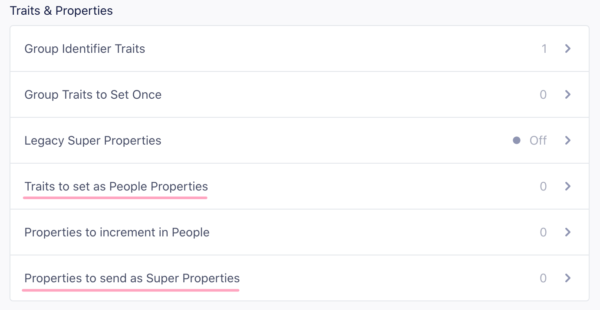
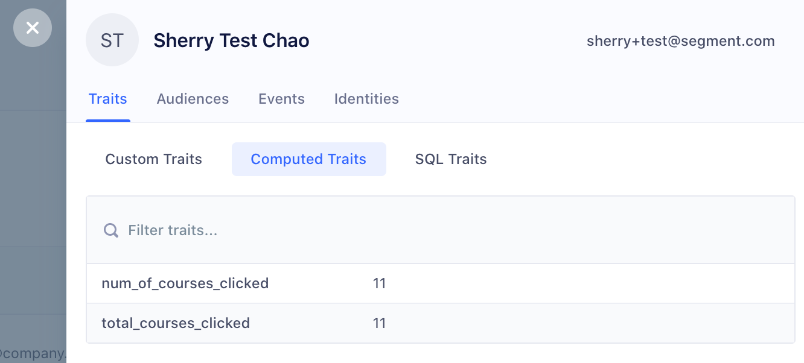
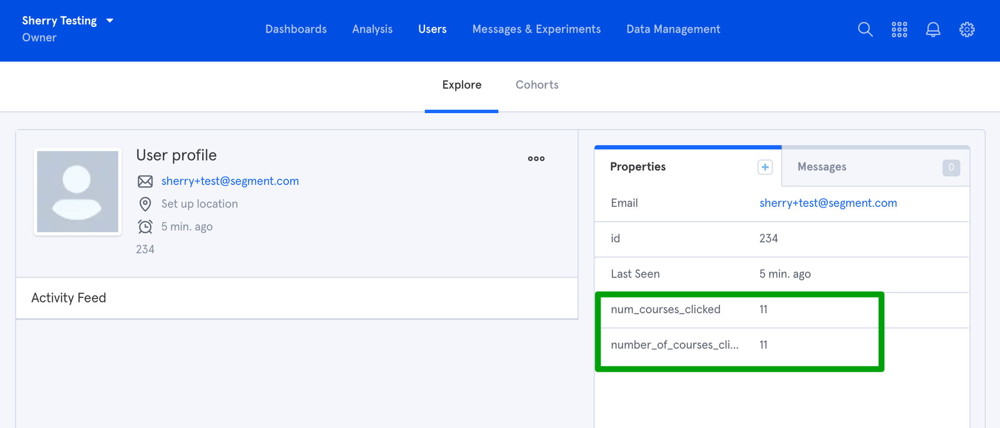
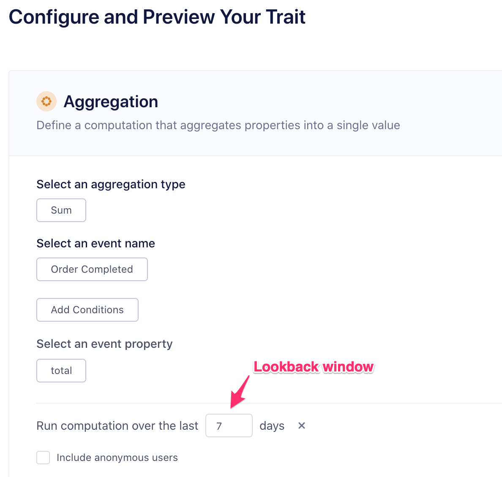
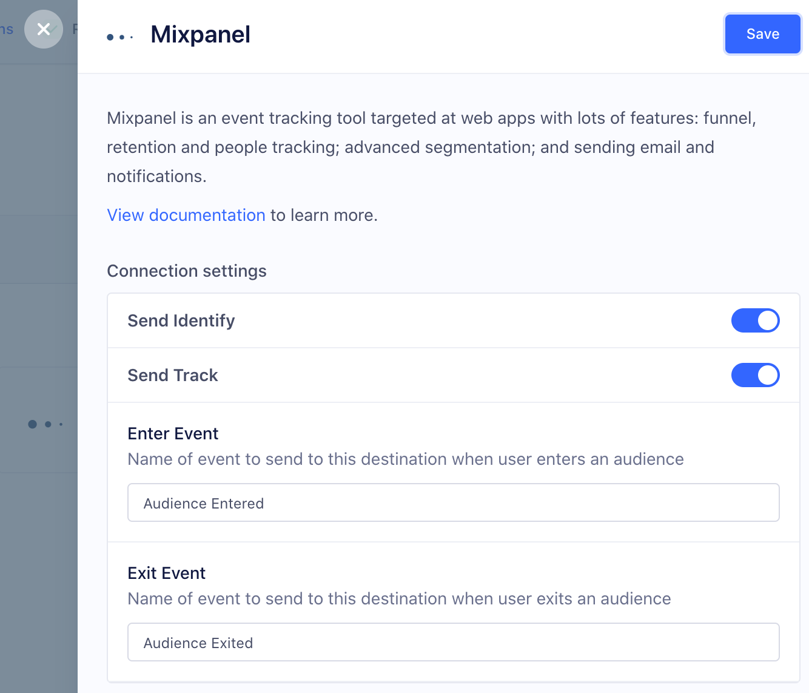
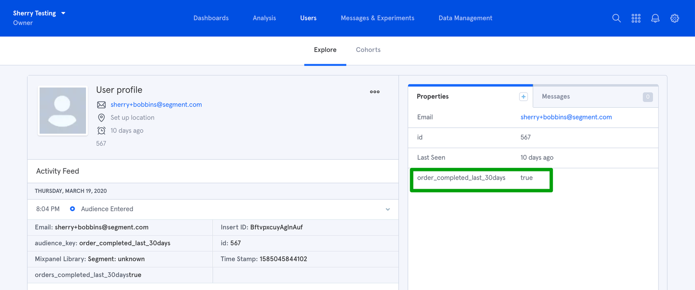
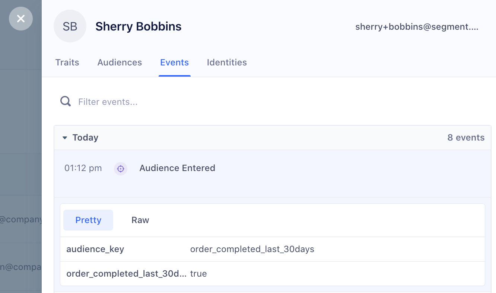
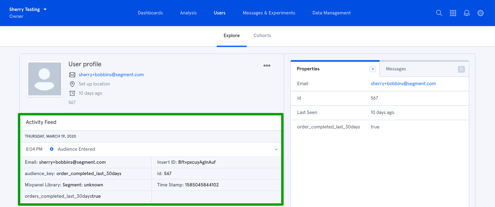
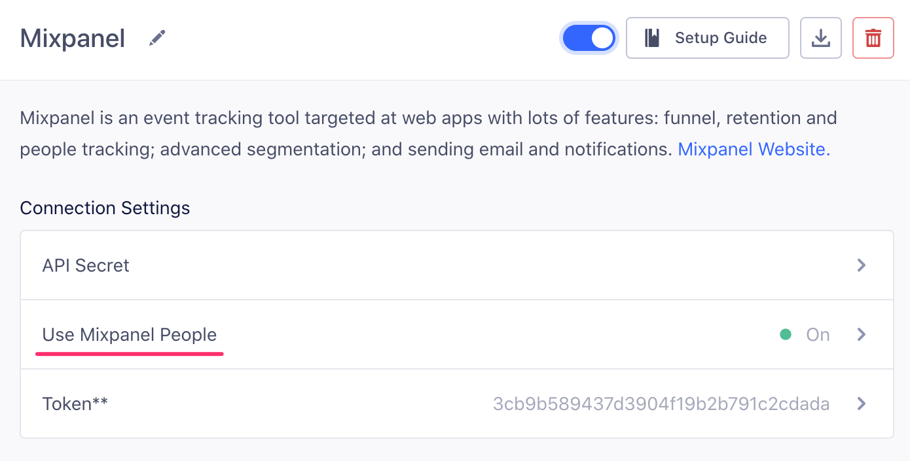

[Mixpanel](https://mixpanel.com/?utm_source=segmentio&utm_medium=docs&utm_campaign=partners) is an event tracking and segmentation platform for your web and mobile apps. By analyzing the actions your users perform, you can gain a better understanding to drive retention, engagement, and conversion. The client-side Mixpanel Destination code is open-source.

Segment's Mixpanel destination code is open source and available on GitHub. You can view these repositories:
- [Analytics.js in Device-mode](https://github.com/segmentio/analytics.js-integrations/tree/master/integrations/mixpanel){:target="_blank"}
- [Android](https://github.com/segment-integrations/analytics-android-integration-mixpanel){:target="_blank"}
- [iOS](https://github.com/segment-integrations/analytics-ios-integration-mixpanel){:target="_blank"}
- [Swift](https://github.com/segment-integrations/analytics-swift-mixpanel){:target="_blank"}
- [Kotlin](https://github.com/segment-integrations/analytics-kotlin-mixpanel){:target="_blank"}

## Getting Started



1. From the Segment app Destinations page click on **Add Destination**.
2. Search for Mixpanel in the Destinations Catalog and confirm the Source to connect to.
3. Copy your Mixpanel "API Secret" and "Token", and paste them into the Connection Settings in Segment.
4. Enable the destination to start sending your data to Mixpanel.

### Adding device-mode SDKs to React Native



## Page
If you're not familiar with the Segment Specs, take a look to understand what the [Page method](/docs/connections/spec/page/) does. An example call would look like:

```javascript
analytics.page()
```

By default, the Page call is transformed to Mixpanel events. This sends all `page` and `screen` calls with a single name, for example `Loaded a Page` or `Loaded a Screen` respectively, with the calls' properties in the body. This gives the best experience of Page/Screen analytics with Mixpanel's reporting.

You can disable this default by changing the "Track All Pages to Mixpanel with a Consolidated Event Name" in the Mixpanel destination settings.

If you want to track the `page` or `screen` calls to Mixpanel with the name or category in the event name, Segment offers these options to send page/screen calls:

1. Track All Pages to Mixpanel with a Consolidated Event Name
2. Track all Pages to Mixpanel
3. Track Categorized Pages to Mixpanel
4. Track Named Pages to Mixpanel

> info ""
> Beginning with "Consolidate Page" calls, the following options are each *mutually exclusive*. [See the code for details](https://github.com/segmentio/analytics.js-integrations/blob/master/integrations/mixpanel/lib/index.js#L96-L139){:target="_blank"}.

### Prioritization of settings

When you use the Mixpanel destination in Cloud-mode, Segment sends events for each option you select. This may result in Mixpanel receiving duplicate events for a single page call.

When you use the Mixpanel destination in Device-mode, Segment prioritizes the options to prevent duplicate calls as follows:


- If you select "Track all Pages to Mixpanel", all `page` calls regardless of how you have customized it will send a `Loaded A Page`. Even if you have the other options enabled, Segment sends this call to prevent double counting your pageviews.

- If you select "Track Categorized Pages to Mixpanel", Segment sends a `Viewed [category] Page` event.

- If you select "Track Named Pages to Mixpanel", Segment sends a `Viewed [name] Page` event.

> info ""
> If both Option 2 and 3 are enabled, Segment gives precedence to `category`. If you pass both `category` and `name`, (for example, `analytics.page('category', 'name');`), Segment sends a `Viewed category name Page` to Mixpanel.

In short, Segment sends one event to Mixpanel per `page` call.

## Identify

If you're not familiar with the Segment Specs, take a look to understand what the [Identify method](/docs/connections/spec/identify/) does. An example call would look like:

```js
analytics.identify('userId123', {
  firstName: 'James',
  lastName: 'Gibbon'
})
```

The first thing you'll want to do is to identify your users so Mixpanel knows who they are. You'll use the Identify method to accomplish this which takes the unique `userId` of a user and any `traits` you know about them.

> info ""
> **Important:** Mixpanel used to require that you call `alias` in all libraries to connect anonymous visitors to identified users. However, with the release of Mixpanel's new [Identity Merge feature](https://help.mixpanel.com/hc/en-us/articles/360039133851#enable-id-merge){:target="_blank"} this is no longer necessary. To enable ID Merge, go to your Mixpanel Settings Dashboard, navigate to **Project Settings > Identity Merge** and enable the setting from that screen. If you are _not_ using this setting, use the instructions below.


As soon as you have a `userId` for a visitor that was previously anonymous you'll need to [`alias`](/docs/connections/spec/alias/) their old anonymous `id` to the new `userId`. In Mixpanel only **one** anonymous user history can be merged to **one** identified user. For that reason you should only call `alias` once, right after a user registered, but before the first `identify`.

### People

Segment doesn't send data to Mixpanel People by default. To enable Mixpanel People, change the "Use Mixpanel People" setting in the Mixpanel Destination settings in Segment.

To add people properties in Mixpanel before you know the user's unique database `userId`, you can identify `traits` without the `userId`.

> info ""
> This only works in Analytics.js and the Segment mobile SDKs.

The `identify` call would look like this in Analytics.js if you only want to set people properties without a `userId`:

```js
analytics.identify({
  email: 'hello@example.com',
  name: 'Ian Taylor'
})
```

## Group

Group calls are sent to Mixpanel if, **and only if**,

1. The Group Identifier Traits setting has one or more traits saved in the destination settings for Mixpanel.
   
2. You have created a group key of the same name in your Mixpanel [project settings](https://help.mixpanel.com/hc/en-us/articles/360025333632-Group-Analytics#implementation){:target="_blank"}.
3. A Group trait with the same name as one of the configured Group Identifier Traits is sent with the group call.

```js
analytics.group("0e8c78ea9d97a7b8185e8632", {
  name: "Initech",
  company_id: "0e8c78ea9d97a7b8185e8632", // Group identifier trait.
  industry: "Technology",
  employees: 329,
  plan: "enterprise",
  "total billed": 830
});
```

Mixpanel supports multiple definitions of groups. For more information see [Mixpanel's Group Analytics documentation](https://help.mixpanel.com/hc/en-us/articles/360025333632-Group-Analytics){:target="_blank"}.

If the group call **does not** have a group trait that matches the Group Identifier Traits setting, then the event will be ignored.

### Group using Device-mode

When you use Analytics.js, you must set a `userId` value, or Mixpanel will ignore Group calls.
When using Analytics.js, a `userId` must be set or group calls to Mixpanel will be ignored. When you call the Identify method from the client in either a browser using Analytics.js or one a mobile SDKs, several things occur:

Segment recognizes and translates the [special traits](/docs/connections/spec/identify/#traits) so that they fit the expectations of Mixpanel's API. The table below shows the mappings. Pass the key on the left and Segment transforms it to the key on the right before sending to Mixpanel.

<table>
  <tr>
    <td>`created`</td>
    <td>`$created`</td>
  </tr>
  <tr>
    <td>`email`</td>
    <td>`$email`</td>
  </tr>
  <tr>
    <td>`firstName`</td>
    <td>`$first_name`</td>
  </tr>
  <tr>
    <td>`lastName`</td>
    <td>`$last_name`</td>
  </tr>
  <tr>
    <td>`name`</td>
    <td>`$name`</td>
  </tr>
  <tr>
    <td>`username`</td>
    <td>`$username`</td>
  </tr>
  <tr>
    <td>`phone`</td>
    <td>`$phone`</td>
  </tr>
</table>

### Group using Cloud-mode

When you call the Identify method from any of Segment's server libraries, Segment creates or updates the user in Mixpanel People with the traits you provide. Calling `identify` doesn't create any users in the standard Mixpanel reporting interface since that only supports `track` events.

You won't see server-side `traits` appear as super-properties on any events you track. This is because Mixpanel [has no REST API](https://github.com/mixpanel/mixpanel-node/issues/48){:target="_blank"} for setting [super properties](https://mixpanel.com/docs/managing-users/managing-user_advanced/specific-properties){:target="_blank"} for a `distinct_id`, so [`identify`](/docs/connections/spec/identify/) calls only affect Mixpanel People.

For Mixpanel People, it's important to `identify` a user before you call `track`. A `track` without an `identify` won't create a user in Mixpanel People.

If you use Cloud-mode, you must explicitly include the grouping value as an event property for any event you want to analyze using Mixpanel's Group Analytics.

### Register Super Properties

By default, each trait (that is, properties in an `identify` call) is registered as a super property. This doesn't require passing a `userId` in the `identify` call. You can pass a `traits` object by itself and it will still register the traits as super properties.

Disable **Set All Traits as Super Properties or People Properties By Default** to disable the default behavior and register super properties explicitly. For more information, see [Explicitly set People Properties and Super Properties](#explicitly-set-people-properties-and-super-properties).

> info ""
> Super properties require a device mode connection.

#### Set People Properties

If you've enabled Mixpanel People in your Segment settings, Segment calls Mixpanel's `people.set` with the same `traits` object. There's no need for an additional API call to populate Mixpanel People.

Disable **Set All Traits as Super Properties or People Properties By Default** to disable the default behavior and register super properties explicitly. Segment automatically includes any trait on an identify that matches one of Mixpanel's special properties, which you can see in the table above. For more information, see [Explicitly set People Properties and Super Properties](#explicitly-set-people-properties-and-super-properties).

If you call `identify` without a `userId`, it may not set the People Properties inside Mixpanel, but it will cache those traits for later use with Segment's `analytics.js`. It is best practice to always call `identify` with a `userId`.

### Arrays

For array type traits passed to `identify` calls, Segment uses Mixpanel's `people.union` to union (append ignoring duplicates) them to their existing values. If the trait doesn't exist a new array will be created for you. To clear the contents of an array trait, you can pass an empty array `[]`.

## Track

If you're not familiar with the Segment Specs, take a look to understand what the [Track method](/docs/connections/spec/track/) does. An example call would look like:
```javascript
analytics.track('Button Clicked')
```
Because Mixpanel is an event tracking analytics tool, you'll want to [`track`](/docs/connections/spec/track/) your user's actions. The more useful events you [`track`](/docs/connections/spec/track/), the better Mixpanel becomes.

You should use the [`track`](/docs/connections/spec/track/) method to accomplish this. The Segment [`track`](/docs/connections/spec/track/) method maps events and event properties directly to Mixpanel events and event properties.

### Track Charge

If Mixpanel People is enabled in your Segment settings and you include an event property called `revenue`, Segment tracks a charge to the current user.

### Reserved Properties

There are two strings to avoid when naming event properties that will be sent to Mixpanel: `length` and `bucket`. `length` is interpreted as the JavaScript `.length` method, which causes the `mixpanel.track` call to fail silently. `bucket` is a reserved property that was used in the early days of Mixpanel. If you include a property called `bucket` in your events, it will not show up in the UI. However, it will not cause the `mixpanel.track` call to fail.

## Alias
If you're not familiar with the Segment Specs, take a look to understand what the [Alias method](/docs/connections/spec/alias/) does. An example call would look like:

```javascript
analytics.alias('newUserId')
```

> info ""
> **Important:** Mixpanel used to require that you call `alias` in all libraries to connect anonymous visitors to identified users. However, with the release of Mixpanel's new [Identity Merge feature](https://help.mixpanel.com/hc/en-us/articles/360039133851#enable-id-merge){:target="_blank"} this is no longer necessary. To enable ID Merge, go to your Mixpanel Settings Dashboard, navigate to **Project Settings > Identity Merge** and enable the setting from that screen. If you are _not_ using this setting, use the instructions below.


As soon as you have a `userId` for a visitor that was previously anonymous you'll need to [`alias`](/docs/connections/spec/alias/) their old anonymous `id` to the new `userId`. In Mixpanel only **one** anonymous user history can be merged to **one** identified user. For that reason you should only call `alias` once, right after a user registered, but before the first `identify`. To merge identities in Mixpanel, send an identify call with both the previous anonymous ID, and the new user ID, as follows:

```javascript
analytics.alias('anonId','newUserId');
```

You can `track` the action that caused the user to be identified or created. For more information, see [Best Practices for Identifying Users](/docs/connections/spec/best-practices-identify/).

Read more about how Mixpanel recommends using `alias` [in their docs](https://mixpanel.com/docs/integration-libraries/using-mixpanel-alias){:target="_blank"}.

> success ""
> Segment recommends that you alias on the client whenever possible, due to technical limitations with aliasing server-side.

### Alias using Device-mode

In client-side JavaScript you only need to pass the new identified `userId`. Segment aliases the old anonymous `id` to your new `userId`.

Here's a JavaScript example where the new `userId` is `12345`:

```javascript
analytics.alias('12345');
analytics.identify('12345');
analytics.track('User Signed Up');
```

### Alias using Cloud-mode

If an `identify` or `track` call arrives to Mixpanel with a new `distinct_id` too quickly after an `alias` call, there is a race condition between the event and the alias call. As long as your `identify` and `track` calls arrive ~1 second after the `alias`, this shouldn't be an issue; when the alias queue is backed up, Mixpanel queues events as well, mitigating the race condition.

However, in cases when events are processed too quickly, before their corresponding alias, your calls can result in split/duplicate profiles.

Mixpanel's client-side JavaScript library fixes this issue by continuing to send `track` calls to the original mixpanel `distinct_id` while the records update.

> success ""
> Segment recommends that you alias for Mixpanel on the client side through Analytics.js to avoid creating split profiles and broken funnels.

However, in certain circumstances, despite the risk of duplicate profiles, you may still wish to send the calls server-side. In those cases, there are two options for calling [`alias`](/docs/connections/spec/alias/) from your servers:

#### In Conjunction with Client-Side Tracking

If you track anonymous users on the client side either from a browser or one of a mobile SDK, pass the Mixpanel `distinct_id` from the browser to your servers in order to [`alias`](/docs/connections/spec/alias/) it to the new `userId`.

First, use [`analytics.ready`](/docs/connections/sources/catalog/libraries/website/javascript#ready) to grab the Mixpanel `distinct_id`:

```js
analytics.ready(function(){
    var anonId = mixpanel.get_distinct_id();
});
```

Next, pass the `anonId` to your server and [`alias`](/docs/connections/spec/alias/), [`identify`](/docs/connections/spec/identify/), and [`track`](/docs/connections/spec/track/) your new user.

Here's a Node example where the new `userId` is `12345`:

```js
analytics.alias({ previousId: anonId, userId: '12345' });
analytics.flush(); // flush the alias

analytics.identify({userId: '12345'});
analytics.track({
  userId: '12345',
  event: 'Connected Facebook'
});
```
Segment recommends that you flush the [`alias`](/docs/connections/spec/alias) to give Mixpanel more time to process it on their side before you [`identify`](/docs/connections/spec/identify) and [`track`](/docs/connections/spec/track).

#### Tracking Exclusively Server Side

If you're tracking anonymous users with a server-side library, you can [`alias`](/docs/connections/spec/alias/) the anonymous `id` to the new `userId`.

Here's a Python example of the [`alias`](/docs/connections/spec/alias/), [`identify`](/docs/connections/spec/identify/), [`track`](/docs/connections/spec/track/) sequence where the anonymous `id` was `92fh49fqh9849hf` and the new `userId` is `12345`:

```python
analytics.alias('92fh49fqh9849hf', '12345')
analytics.flush() # flush the alias

analytics.identify('12345')
analytics.track('12345', 'Registered')
```

Segment recommends that you flush the [`alias`](/docs/connections/spec/alias) to give Mixpanel more time to process it on their side before you [`identify`](/docs/connections/spec/identify) and [`track`](/docs/connections/spec/track).

## Best Practices

### Collecting contextual properties

If you send events server side, depending on your library (JS, mobile, or server), Segment maps as many [Mixpanel supported contextual properties](https://mixpanel.com/help/questions/articles/what-properties-do-mixpanels-libraries-store-by-default){:target="_blank"} as possible.

You can see which [context properties are being automatically collected by any Segment library](/docs/connections/spec/common/). If you use a library that doesn't support a certain contextual property, you can still send them manually with your events, as long as it's sent in accordance with the [spec](/docs/connections/spec/common/).

For example, if you want to send `utm` parameters with your server side library, you can attach a `context.campaign` object like this:

```javascript
// node library

analytics.track({
  userId: '019mr8mf4r',
  event: 'Purchased an Item',
  properties: {
    revenue: 39.95,
    shippingMethod: '2-day'
  },
  context: {
    campaign: {
      name: "TPS Innovation Newsletter",
      source: "Newsletter",
      medium: "email",
      term: "tps reports",
      content: "image link"
    }
  }
});
```

Segment doesn't map `$library_version` since that is reserved for Mixpanel's library version, not Segment's. Segment doesn't map to `$brand`.

- - -

## Features


### People

Segment doesn't send data to Mixpanel People by default. To enable Mixpanel People, change the "Use Mixpanel People" setting in the Mixpanel Destination settings in Segment.

If you want to add people properties in Mixpanel before you know the user's unique database `userId` you can identify `traits` without the `userId`.

<!-- Removing this note as this has been tested with our server libraries and works (Feb 2020) -->
<!--**Note:** this only works in Analytics.js and our mobile SDKs.-->

Your `identify` call would look like this in Analytics.js if you only want to set people properties without a `userId`:

```js
analytics.identify({
  email: 'example@example.com',
  name: 'Ian Taylor'
})
```

### UTM Campaign Parameters

When used in Device Mode through a web source, Segment's client-side Javascript library, Analytics.js, loads `mixpanel.js` (Mixpanel’s direct SDK) in the background, so you'll get the exact same functionality from Mixpanel around UTM Campaign Parameters as you would when using Mixpanel directly.

[Read more in Mixpanel's UTM docs](https://mixpanel.com/help/questions/articles/can-i-track-google-analytics-style-utm-tags-with-mixpanel)

In order to pass UTM parameters server-side, you can either pass properties or traits of `utm_source`, `utm_medium`, `utm_campaign`, `utm_content`, and `utm_term` in your track and identify calls, or pass them in your `context` object, for example:

```javascript
// node library

analytics.track({
  userId: '019mr8mf4r',
  event: 'Item Purchased',
  properties: {
    revenue: 39.95,
    shippingMethod: '2-day'
  },
  context: {
    campaign: {
      name: "TPS Innovation Newsletter",
      source: "Newsletter",
      medium: "email",
      term: "tps reports",
      content: "image link"
    }
  }
});
```

### Explicitly Set People Properties and Super Properties

Previously, Segment set all traits and properties as both Super Properties and People Properties (If you had Mixpanel People enabled). Now Mixpanel allows you to segment your reports by both People Properties and Super Properties. To give you better precision and control over what property or trait gets set as a Super Property or People Property, you can disable **Set All Traits as Super Properties or People Properties By Default** and pass in the properties or traits that you want to send to Mixpanel as People or Super Properties as shown below. Segment passes through all of Mixpanel's special traits as People Properties so you only need to add the ones that aren't on [this list](#group-using-device-mode).




### Incrementing events

You don't need to add extra code to increment event counts for Mixpanel people, as long as they are "known users". Supply the events that should be incremented.


You can find this in the **Advanced Options** of your Mixpanel settings on your Segment Destinations page.

For each event name listed, Segment calls Mixpanel `increment`, and set a user trait of `Last + {{ event.name }}`.

For example, if you add **Logged In** to the list of increment events, Segment increments a user trait called **Logged In** and set a trait called **Last Logged In** with the current date and time.

If you'd like to add an increment for viewing a specific page or screen, ensure you have the setting "Track Named Pages" selected and use the dynamically generated event name under "Events to Increment in People." For example, `.page('Signup')` would translate to "*Viewed* Signup *Page*" and `.screen('Listing')` would translate to "*Viewed* Listing *Screen*".

Remember, Segment sends one event per `page` call.

> info ""
> Increment works for "known users", so if your track call is being made server-side, you need to pass a `userId`. If your track call is being made client-side, you need to identify the user first.

### Incrementing properties

To increment at the property level, tell Segment which properties you want to increment using the **Properties to increment** setting and Segment calls Mixpanel's `increment` for you when you attach a number to the property (for example, `'items purchased': 5`)

### Reset Mixpanel Cookies

When a user logs out, Segment recommends that you call `analytics.reset();` to clear the Segment cookie. This function isn't mapped to Mixpanel's reset method. If you have issues with `distinct_id` for example, if it's not matched with the right user, you should add this to your logout flow:

```javascript
analytics.ready(function(){
  window.mixpanel.cookie.clear();
});
```
### Ignore IP from Server to Disable Geo-location in Mixpanel People

To avoid having any IP address sent to Mixpanel and by doing so, turn off geo-location for server-side users, pass the `context.ip` as 0.

Here's a python example:

```python
analytics.track(user_id=user.id,
  event='Ignore My IP', context={
  'ip': 0
})
```

Provide `context.ip` to all your [`identify`](/docs/connections/spec/identify/), [`track`](/docs/connections/spec/track/), and [`alias`](/docs/connections/spec/alias/) calls to make sure Mixpanel doesn't geo-locate your users.

### Sending data to Mixpanel's European Union Endpoint

To implement Mixpanel in the European Union, enable the setting "Enable European Union Endpoint" on the Settings tab of the Mixpanel destination. When this setting is enabled, Segment updates the endpoint for any data sent from server-side libraries, browsers using Analytics.js, or the iOS SDK.

If you send data with the Android SDK, specify the different endpoints with meta-data tags. On your app's `AndroidManifest.xml` file, add the following tags under your `<application>` tags to override the track, engage, and group endpoints:

```xml
<meta-data android:name="com.mixpanel.android.MPConfig.EventsEndpoint"
           android:value="https://api-eu.mixpanel.com/track?ip=" />
<meta-data android:name="com.mixpanel.android.MPConfig.PeopleEndpoint"
           android:value="https://api-eu.mixpanel.com/engage=" />
<meta-data android:name="com.mixpanel.android.MPConfig.GroupsEndpoint"
           android:value="https://api-eu.mixpanel.com/groups" />
```

See the [Mixpanel documentation on their European Union endpoint](https://developer.mixpanel.com/docs/implement-mixpanel#section-implementing-mixpanel-in-the-european-union-eu){:target="_blank"} for additional information.

## Troubleshooting

### When Will I See Data from my Mobile App?

If you already have an app deployed with the Segment library, and you just enabled Mixpanel mobile, it can take up to an hour for all your mobile users to refresh their Segment settings cache, and learn about the new service that you want to send to.

After the settings cache refreshes, the library starts to send data to Mixpanel.

Also worth noting, Mixpanel's SDK only submits requests to the Mixpanel servers when the app is backgrounded. That means you may see events in your Segment debugger while testing, but those requests won't actually be forwarded to Mixpanel until the app gets sent to the background.

If you're testing in Xcode remember you must first background the app, then the events will show up in Mixpanel. If you terminate the session without backgrounding those events will be lost.

### I'm seeing events come into Mixpanel but not people.

1. You'll need to make sure you're using [`identify`](/docs/connections/spec/identify/). A Mixpanel track doesn't create users in Mixpanel People.
2. Make sure to turn on the "People" setting so that all of your [`identify`](/docs/connections/spec/identify/) calls will be sent to Mixpanel's People feature.
3. Make sure you disable the default filter in the Mixpanel People Explore tab.

## Appendices

### IP

If an `ip` property is passed to Mixpanel, the value will be interpreted as the IP address of the request and therefore automatically parsed into Mixpanel geolocation properties (City, Country, Region). After that IP address has been parsed, they will throw out the IP address and only hold onto those resulting geolocation properties. As such, if you want to display an IP address as a property within the Mixpanel UI or within raw data, you will simply want to slightly modify the naming convention for that property.

Instead of `ip`, you can use a property name of `user IP` or `IP Address` (whatever is most clear for your implementation). This way, Mixpanel won't automatically interpret the IP address as an IP address, and instead store that value as a property on the event. You can read more [here](https://mixpanel.com/help/reference/http#tracking-events){:target="_blank"}.


### Bypass "Last Seen" in Server-side Calls

You can bypass the automatic re-setting of the "Last Seen" date property by passing **active** with a value of `false` in the `context` object, as follows:

```python
analytics.identify(
  user_id='12345',
  traits={
    'name': 'Frank'
  },
  context={
    'active': false
  }
)
```

### Push Notifications

Push notifications are only available for projects bundling the Segment-Mixpanel SDK.

> info ""
> Set up your push notification handlers by calling into native Mixpanel methods. You can read more about how to approach this in the [iOS](/docs/connections/sources/catalog/libraries/mobile/ios/#what-if-your-sdk-doesnt-support-feature-x) and [Android](/docs/connections/sources/catalog/libraries/mobile/android/#how-can-i-use-a-destination-specific-feature) documentation.

### In-App Notifications

In-app notifications are only available for projects either bundling the Segment-Mixpanel SDK or using the client-side Web integration. Configure in-app notification handlers by calling into native Mixpanel methods.

> info ""
> Read more about how to approach this in the [iOS](/docs/connections/sources/catalog/libraries/mobile/ios/#what-if-your-sdk-doesnt-support-feature-x) and [Android](/docs/connections/sources/catalog/libraries/mobile/android/#how-can-i-use-a-destination-specific-feature) documentation.

### A/B Testing

> info ""
> Configure push notification handlers by calling into native Mixpanel methods. You can read more about how to approach this in the [iOS](/docs/connections/sources/catalog/libraries/mobile/ios/#what-if-your-sdk-doesnt-support-feature-x) and [Android](/docs/connections/sources/catalog/libraries/mobile/android/#how-can-i-use-a-destination-specific-feature) documentation.

#### Device Connection Mode (Bundled Mobile SDK)

Segment supports Mixpanel push notifications automatically using the [didRegisterForRemoteNotificationsWithDeviceToken method](/docs/connections/sources/catalog/libraries/mobile/ios/#how-do-i-use-push-notifications).

For *in-app* notifications and surveys, follow the Mixpanel documentation [here](https://developer.mixpanel.com/docs/swift#in-app-messages){:target="_blank"}. Use the native functionality to control when to show an in-app message by following the instructions [here](/docs/connections/sources/catalog/libraries/mobile/ios/#what-if-your-sdk-doesnt-support-feature-x) and calling the native Mixpanel methods.

#### Cloud Connection Mode (Unbundled/ Server-side)

If you use Mixpanel server side and you have access to your users' device tokens, you can import into Mixpanel by sending the token using `context.device.token` as described in the [specs](/docs/connections/spec/common/#context) with an `identify` call. Segment sends the token as Mixpanel's special trait `$ios_devices`. This only works on iOS. In order to use push on Android, you must bundle the Mixpanel SDK.

For example, using the [node library](/docs/connections/sources/catalog/libraries/server/node/):

```javascript
analytics.identify({
  userId: '019mr8mf4r',
  traits: {
    name: 'Michael Bolton',
    email: 'mbolton@example.com',
    plan: 'Enterprise',
    friends: 42
  },
  context: {
    device: {
      token: 'ff15bc0c20c4aa6cd50854ff165fd265c838e5405bfeb9571066395b8c9da449'
    }
  }
});
```

### Tracking Mixpanel Push Notification Open Rate

To enable push tracking, click the checkbox within Mixpanel as explained in [Mixpanel's documentation](https://mixpanel.com/help/questions/articles/how-do-i-track-push-notification-open-rate){:target="_blank"}. This feature allows push notification opens to be tracked as properties of an app open event, however this will miss pushes which are received when the app is already open.

To add push open tracking, Mixpanel requires that on initialization Mixpanel is launched with options. Segment makes this available through the factory `(instancetype)createWithLaunchOptions:(NSString *)token launchOptions:(NSDictionary *)launchOptions;`

*Note*: Push open tracking in Android is not currently supported by the Mixpanel Android library.


## Using Mixpanel with Engage

Mixpanel is a product analytics platform that is compatible as a Engage destination.

You can send computed traits and audiences created in Engage to Mixpanel and use them to create dashboards, run cohort analyses, or to power messages.




### Using Engage Computed Traits with Mixpanel

You can send Computed Traits created in Engage to Mixpanel as `identify` calls to create user properties in Mixpanel.



You can check a specific user profile in Mixpanel for Computed Traits by going to **Users → Explore** and search for a specific user to view their profile.




Computed traits without a lookback window search across all historical events, and update in real time.

Computed traits with a lookback window only search across events that occurred within the specified time frame. Computed traits *with* a lookback window are updated hourly.




If you choose to include anonymous users when you create the computed trait, you must use the [`alias` call](#alias) to merge user profiles when they become a known user.


### Using Engage Audiences with Mixpanel

You can send Engage Audiences to Mixpanel as `identify` or `track` calls. You can choose the type of call to send when you add Mixpanel as a destination for an audience.




When you send custom traits as `identify` calls, the name of the audience is added to the user's profile as a user trait, with a boolean value to indicate if the user is in the audience. For example, when a user first completes an order in the last 30 days, Segment sends an `identify` call with the property `order_completed_last_30days: true`. When this user no longer satisfies these criteria (for example when their last purchase was more than 30 days ago) Engage sets that value to `false`.


You can check a specific user profile in Mixpanel for Computed Traits by going to **Users → Explore** and searching for a specific user to view their profile.




When you first create an audience, Engage sends an  `identify` call for every user in the audience. Later syncs only send updates for users who were added or removed from the audience since the last sync.


When you use `track` calls, Segment sends an `Audience Entered` event when the user enters the audience, with the audience name as a property of the event. When the user exits the audience, Engage sends an `Audience Exited` event with the same property.





You can check a specific user profile in Mixpanel for audience events by going to **Users → Explore** and searching for a specific user to view their profile. Look for `Audience Entered` and `Audience Exited` events in the Activity Feed.



Audiences without a lookback window searches across all historical events and update in real time.

Audiences with a lookback window only search across events that occurred within the specified time frame. Audiences *with* a lookback window are updated hourly.


If you choose to include anonymous users when you create an audience, you must use the [alias call](#alias) to merge user profiles when they become a known user.


## Setting Up Engage and Mixpanel

To send computed traits or audiences to Mixpanel, connect the destination to your Space. Once it's set up, you can select Mixpanel as a destination for Engage data when you create computed traits or audiences.

1. In your Segment workspace, click Engage in the left navigation bar, and select your Space.
2. Click **Engage Settings** and select the **Destinations** tab.
3. Click **Add Destination**.
2. Search for Mixpanel and click add destination.
3. Enter your API Secret and Token for the integration.
4. Enable the "Use Mixpanel People” toggle. This allows Engage to send `identify` calls to Mixpanel.

> success ""
> **Tip**: Mixpanel now accepts Identify calls by default. Previously, this was an additional paid feature.





## Mixpanel Engage Details

- **Supports Engage**: Yes
- **Engage Destination type**: Event Method (data is delivered to this Destination one-by-one on a realtime basis)
- **Traits and Audiences created by**: Traits and audiences are added as user properties using `identify` calls. You can send Audiences as `Audience Entered` or `Audience Exited track` calls with the audience name as an event property.
- **Must create audience_name field before Engage can update those values?**: No. If sent as an `identify` call, Engage auto-creates the computed trait or audience name as a user property.
- **Audience appears as**:
    - Computed traits appear as a lower case user property with spaces converted to underscores.
    - For audiences sent as an `identify` call, Engage creates a lower case boolean (true/false) user property. Spaces are converted to underscores.
    - For audiences sent as a `track` call, Engage sends `Audience Entered` and `Audience Exited` events with the audience name as an event property.
- **Destination rate limit**: [None](https://help.mixpanel.com/hc/en-us/articles/115004602563-Rate-Limits-for-API-Endpoints#track-and-engage-endpoints){:target="_blank"}
- **Lookback window allowed**: Yes, unlimited.
- **Identifiers required** : `userId` or `anonymousId`
- **Identifiers accepted** : `userId` or `anonymousId`
- **Client or Server-Side Connection**: Server-side


## Mixpanel Engage FAQs

**What happens if I delete an audience or trait in Segment?**

If you delete an audience or trait in Segment, it isn't deleted from Mixpanel. To remove an audience-created property in Mixpanel, you must use either [the Mixpanel Engage API using the $unset method or hide user properties from the Lexicon](https://help.mixpanel.com/hc/en-us/articles/115004567926-Hide-or-Delete-Events-Properties-Users){:target="_blank"}.

**If a user has multiple external ids in Segment, what happens when they enter an audience or have a computed trait?**

Segment sends an `identify` or a  `track` call for each external on the user's account. For example, if a user has three email addresses, and you are sending `identify` calls for your audience, Engage sends three `identify` calls to Mixpanel and adds the latest email address to the user profile as the email “address of record” on the Mixpanel user profile.
