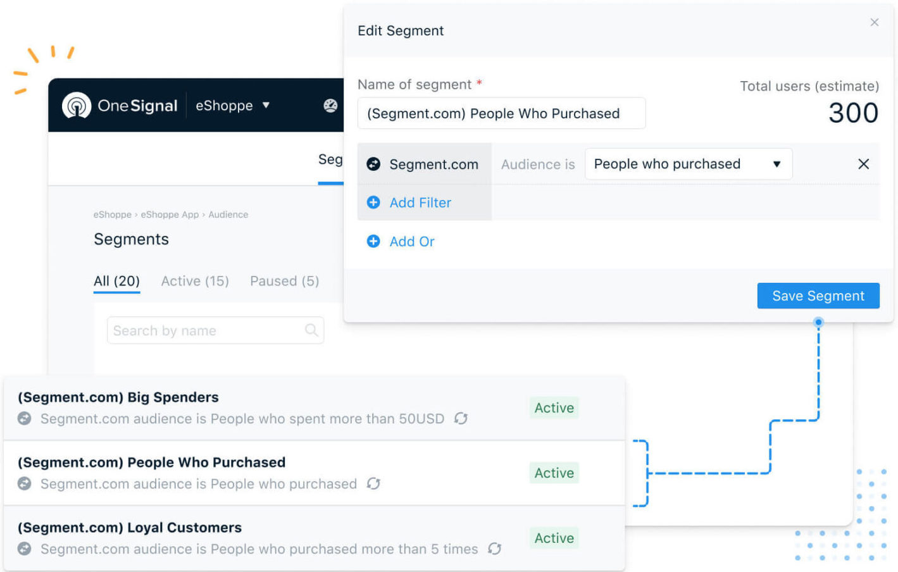

# OneSignal Destination
[OneSignal](https://onesignal.com/?utm_source=segmentio&utm_medium=docs&utm_campaign=partners) is the market leader in driving customer engagement with multi-channel messaging across Web and Mobile Push, In-App Messages, SMS, and Email subscribers.
This destination is maintained by OneSignal. For any issues with the destination, [contact OneSignal Support team](mailto:support@onesignal.com).

**Note**: *The OneSignal Destination is currently in beta.*
This means that OneSignal is still actively developing the destination and some functionality may change before it becomes generally available.

# Getting Started
**Do not remove this line. It will auto-populate the following information for your integration:** **https://cl.ly/23e637f055f7


1. From the Destinations catalog page in the Segment App, click **Add Destination**.
1. Search for "OneSignal" in the Destinations Catalog, and select the "OneSignal" destination.
1. Choose which Source should send data to the "OneSignal" destination.
1. Go to the [OneSignal dashboard](https://app.onesignal.com/apps/), select the App and go to the Settings → Keys & IDs. Copy the “App ID” and the “API key”.
1. Enter the OneSignal “App ID” and the “API key” in the "OneSignal" destination settings in Segment and Enable the App.
1. Please make sure you have an “[External User ID](https://documentation.onesignal.com/docs/onboarding-with-onesignal#step-3-connect-user-data-to-onesignal)” set for your users on OneSignal. OneSignal uses the “External User ID” to match with the “User ID” value from Segment.com.

> *OneSignal Destination app is accessible only to customers on OneSignal Professional and Enterprise plans.*

# Identify
If you aren't familiar with the Segment Spec, take a look at the [Identify method documentation](https://segment.com/docs/connections/spec/identify/) to learn about what it does. An example call would look like:
```js
analytics.identify('userId123', {
  firstName: 'John',
  lastName: 'Doe',
     country: ‘USA’
});
```

These user traits will appear as player [data tags](https://documentation.onesignal.com/docs/add-user-data-tags) in OneSignal.

*Note:* OneSignal does not accept nested objects or arrays as user properties.


# Track
If you aren't familiar with the Segment Spec, take a look at the [Track method documentation](https://segment.com/docs/connections/spec/track/) to learn about what it does. An example call would look like:
```js
analytics.track('Add to Cart', {
    product_name: 'Sunglasses',
    brand: 'Rayban'
})
```

For events and associated properties sent using Track call, OneSignal will *drop* the event name (for example, *Add to Cart*), but store all the properties (for example, *productname and brand*) as data tags.


# Personas
You can send computed traits and audiences generated using [Segment Personas](https://segment.com/docs/personas) to OneSignal destination. To learn more about Personas, contact us for a [demo](https://segment.com/contact/demo).

### Audiences
Persona Audiences automatically show up as a [segment](https://documentation.onesignal.com/docs/segmentation) in OneSignal.

Audiences sent using a **Track call** will create a OneSignal [segment](https://documentation.onesignal.com/docs/segmentation) with the *Audience Name*.

Audiences sent using an **Identify call** will
1. create a OneSignal segment with the *Audience Name* and
2. add data tags (if there are additional properties in the Identify call) on all the matching user records.



The Identify and Track calls are sent to OneSignal whenever a user enters or exits the Audience.

### Computed Traits
Personas Computed Traits are stored as [Data Tags](https://documentation.onesignal.com/docs/add-user-data-tags) on the OneSignal user (player) records whether passed to OneSignal as an Identify call or a Track call. You can then use these data tags to manually create OneSignal segments and automate your messaging workflows.


# OneSignal Destination FAQ

**Managing Segment’s Reserved and Custom Traits**
* All the Segment’s user traits are sent to OneSignal as data tags. The number of data tags allowed on OneSignal depends on your OneSignal pricing plan. Tags over the entitled number will be dropped.
* OneSignal always updates the firstName and the lastName properties for matching users. All other traits are added/updated on a firstcome basis. *firstName* and *lastName* tags are stored as "first_name" and "last_name".
* User properties sent to OneSignal with blank/null values are removed from the OneSignal user record. This is done to make sure you are within your data tag limits.
* OneSignal doesn’t store email and phone properties as these key identifiers are stored as separate player records in OneSignal. To update user traits for these records in OneSignal
    * You must create a player record with the email address and/or a phone number and map those records with the External_User_ID.
    * Additional properties sent from Segment will then be automatically mapped across all your matching records, including email and phone number records.
