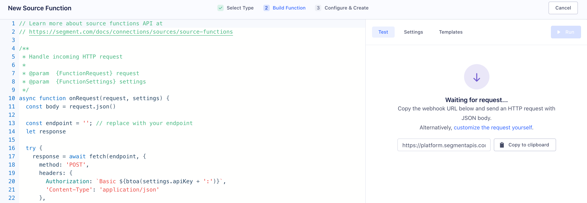
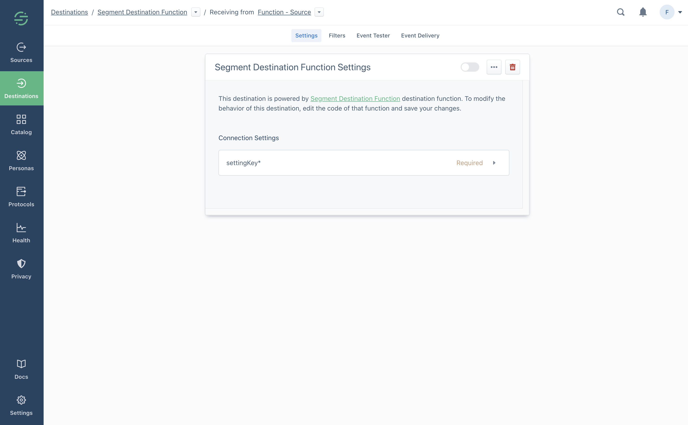
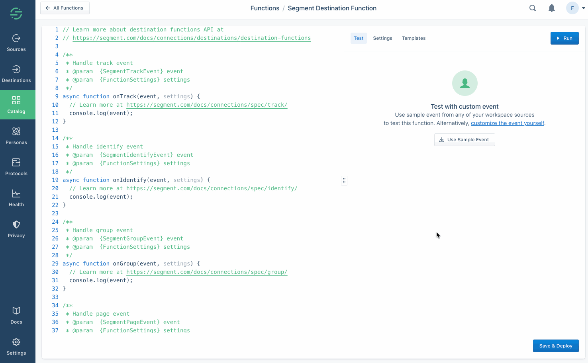
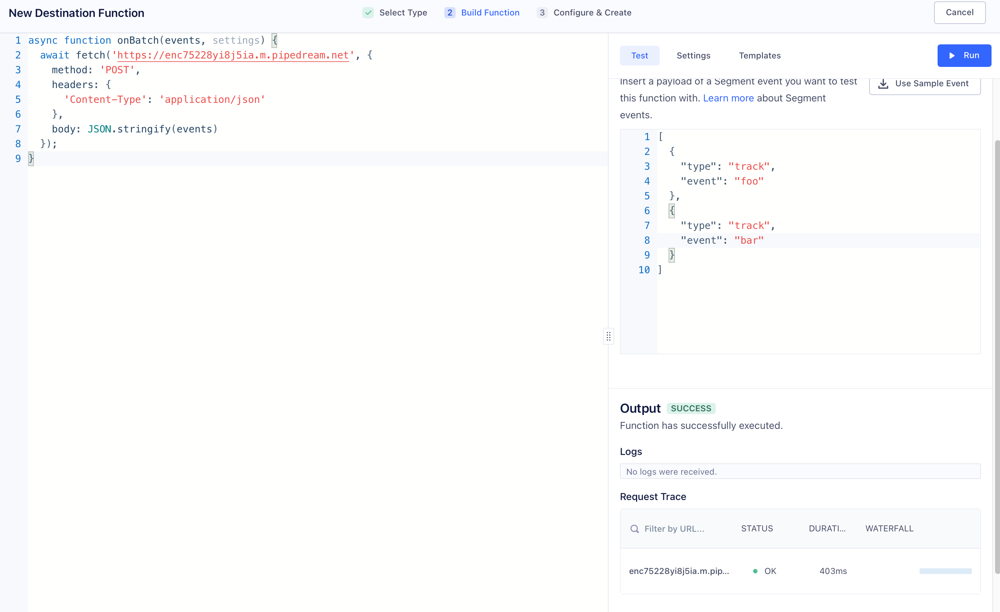
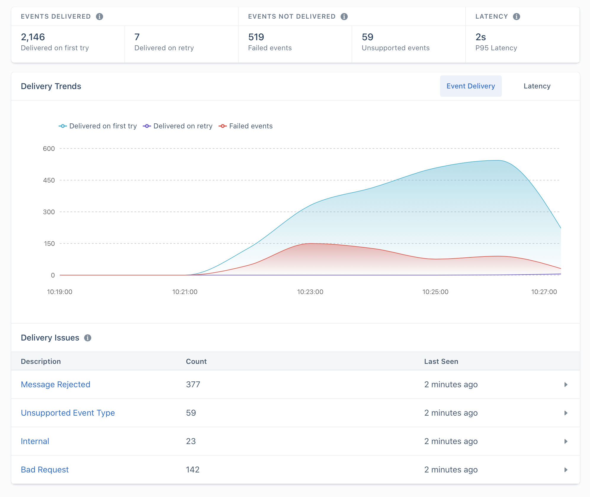
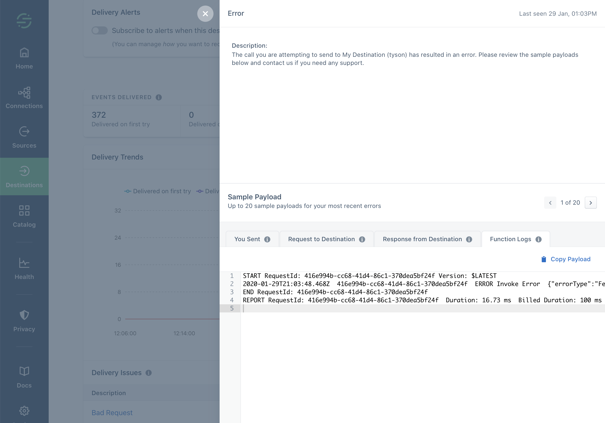

Destination functions allow you to transform and annotate your Segment events and send them to any external tool or API without worrying about setting up or maintaining any infrastructure.

All functions are scoped to your workspace, so members of other workspaces can't view or use them.

> info ""
> Functions is available to all customer plan types with a free allotment of usage hours. Read more about [Functions usage limits](/docs/connections/functions/usage/), or see [your workspace's Functions usage stats](https://app.segment.com/goto-my-workspace/settings/usage?metric=functions).


> note ""
> Destination functions does not accept data from [Object Cloud sources](/docs/connections/sources/#object-cloud-sources).

## Create a destination function

1. From your workspace, go to the Catalog and click the [Functions tab](https://app.segment.com/goto-my-workspace/functions/catalog).
2. Click **New Function**.
3. Select **Destination Function** and click **Build**.

> success ""
> **Tip:** Want to see some example functions? Check out the templates available in the Functions UI, or in the open-source [Segment Functions Library](https://github.com/segmentio/functions-library). (Contributions welcome!)

When you click **Build**, a code editor appears. Use the editor to write the code for your function, configure settings, and test the function's behavior.



## Code the destination function

Segment invokes a separate part of the function (called a "handler") for each event type that you send to your destination function.

> info ""
> Your function is not invoked for an event if you've configured a [destination filter](/docs/connections/destinations/destination-filters/), and the event doesn't pass the filter.

The default source code template includes handlers for all event types. You do not need to implement all of them - just use the ones you need, and skip the ones you don't.

Destination functions can define handlers for each message type in the [Segment spec](/docs/connections/spec/):

- `onIdentify`
- `onTrack`
- `onPage`
- `onScreen`
- `onGroup`
- `onAlias`
- `onDelete`
- `onBatch`

Each of the functions above accepts two arguments:

- **event** - Segment event object, where fields and values depend on the event type. For example, in "Identify" events, Segment formats the object to match the [Identify spec](/docs/connections/spec/identify/).
- **settings** - Set of [settings](#create-settings-and-secrets) for this function.

The example below shows a destination function that listens for "Track" events, and sends some details about them to an external service.

```js
async function onTrack(event) {
  await fetch('https://example-service.com/api', {
    method: 'POST',
    headers: {
      'Content-Type': 'application/json'
    },
    body: JSON.stringify({
      event_name: event.event,
      event_properties: event.properties,
      timestamp: event.timestamp
    })
  })
}
```

To change which event type the handler listens to, you can rename it to the name of the message type. For example, if you rename this function `onIdentify`, it listens for "Identify" events instead.

> info ""
> Functions' runtime includes a `fetch()` polyfill using a `node-fetch` package. Check out the [node-fetch documentation](https://www.npmjs.com/package/node-fetch) for usage examples.

### Errors and error handling

Segment considers a function's execution successful if it finishes without error. You can also `throw` an error to create a failure on purpose. Use these errors to validate event data before processing it, to ensure the function works as expected.

You can `throw` the following pre-defined error types to indicate that the function ran as expected, but that data was deliverable:

- `EventNotSupported`
- `InvalidEventPayload`
- `ValidationError`
- `RetryError`

The examples show basic uses of these error types.

```js
async function onGroup(event) {
  if (!event.traits.company) {
    throw new InvalidEventPayload('Company name is required')
  }
}

async function onPage(event) {
  if (!event.properties.pageName) {
    throw new ValidationError('Page name is required')
  }
}

async function onAlias(event) {
  throw new EventNotSupported('Alias event is not supported')
}

async function onTrack(event) {
  let res
  try {
    res = await fetch('http://example-service.com/api', {
      method: 'POST',
      headers: {
        'Content-Type': 'application/json'
      },
      body: JSON.stringify({ event })
    })
  } catch (err) {
    // Retry on connection error
    throw new RetryError(err.message)
  }
  if (res.status >= 500 || res.status === 429) {
    // Retry on 5xx and 429s (ratelimits)
    throw new RetryError(`HTTP Status ${res.status}`)
  }
}

```
If you do not supply a function for an event type, Segment throws an `EventNotSupported` error by default.

You can read more about [error handling](#destination-functions-logs-and-errors) below.

### Runtime and dependencies




<!-- TODO - could also go into the `runtime.md` include above, if applied identically to both types of functions.
## Batching in functions   -->

## Create settings and secrets



Next, fill out this setting's value in the **Test** tab, so you can run the function and verify that the correct setting value is passed. (This value is only for testing your function.)

{:width="500"}

Now that you've configured a setting and entered a test value, you can add code to read its value and run the function, as in the example below:

```js
async function onTrack(request, settings) {
  const apiKey = settings.apiKey
  //=> "super_secret_string"
}
```

When you deploy your destination function in your workspace, you fill out the settings on the destination configuration page, similar to how you would configure a normal destination.



## Test the destination function

You can test your code directly from the editor in two ways:

### Use sample events for testing

Click **Use Sample Event** and select the source to use events from.



Click **Run** to test your function with the event you selected.

### Test using manual input

You can also manually include your own JSON payload of a Segment event, instead of fetching a sample from one of your workspace sources.


If your function fails, you can check the error details and logs in the **Output** section.

- **Error Message** - This shows the error surfaced from your function.
- **Logs** - This section displays any messages to `console.log()` from the function.

## Batching the destination function

Batch handlers are an extension of destination functions. When you define an `onBatch` handler alongside the handler functions for single events (for example: `onTrack` or `onIdentity`), you're telling Segment that the destination function can accept and handle batches of events.

> info ""
> Batching is available for destination functions only.

### When to use batching

Consider creating a batch handler if:

- **Your function sends data to a service that has a batch endpoint.** Batch endpoints may allow you both to send more data downstream and stay within the rate limits imposed by the service. Batch handlers that use one or more batch endpoints improve the efficiency of the function, and enable it to scale more easily. Specifically, you can use batch handlers to build [list-based](/docs/personas/using-personas-data/#personas-destination-types-event-vs-list) Personas destinations.
- **You have a high-throughput function and want to reduce cost.** When you define a batch handler, Segment invokes the function once per *batch*, rather than once per event. As long as the function's execution time isn't adversely affected, the reduction in invocations should lead to a reduction in cost.

> info ""
> If a batched function receives too low a volume of events (under one event per second) to be worth batching, Segment may not invoke the batch handler.

### Define the batch handler

Segment collects the events over a short period of time and combines them into a batch. The system flushes them when the batch reaches a certain number of events, or when the batch has been waiting for a specified wait time.

To create a batch handler, define an `onBatch` function within your destination function.
You can also use the "Default Batch" template found in the Functions editor to get started quickly.

```js
async function onBatch(events, settings){
  // handle the batch of events
}
```

> info ""
> The `onBatch` handler is an optional extension. Destination functions must still contain single event handlers as a fallback, in cases where Segment does not receive enough events to execute the batch.

The handler function receives an array of events. The events can be of any supported type, and a single batch may contain more than one event type. Handler functions also receive function settings.

For example, you could send the array of events to an external services batch endpoint:

```js
async function onBatch(events, settings) {
  await fetch('https://example-service.com/batch-api', {
    method: 'POST',
    headers: {
      'Content-Type': 'application/json'
    },
    body: JSON.stringify(events) // send a JSON array
  })
}
```


### Configure the event types within a batch

Segment batches together any event _of any type_ that it sees over a short period of time to increase batching efficiency and give you the flexibility to decide how batches are created. If you want to split batches by event type, you can implement this in your functions code by writing a handler.

If your downstream endpoint requires events of a single type, you can write a handler that groups events by type, and then handles the events.

```js
async function onBatch(events, settings) {
  // group events by type
  const eventsByType = {}
  for (const event of events) {
    if (!(event.type in eventsByType)) {
      eventsByType[event.type] = []
    }
    eventsByType[event.type].push(event)
  }

  // concurrently process sub-batches of a specific event type
  const promises = Object.entries(eventsByType).map(([type, events]) => {
    switch (type) {
    case 'track':
      return onTrackBatch(events, settings)
    case 'identify':
      return onIdentifyBatch(events, settings)
    // ...handle other event types here...
    }
  })
  return Promise.all(promises)
}

async function onTrackBatch(events, settings) {
  // handle a batch of track events
}

async function onIdentifyBatch(events, settings) {
  // handle a batch of identify events
}
```

### Configure your batch parameters

By default, Functions waits up to 10 seconds to form a batch of 20 events. You can increase the number of events included in each batch (up to 400 events per batch) by contacting [Segment support](https://segment.com/help/contact/){:target="_blank"}. Segment recommends users who wish to include fewer than 20 events per batch use destination functions without the `onBatch` handler. 

### Test the batch handler

The [Functions editing environment](/docs/connections/functions/environment/) supports testing batch handlers. In the right panel of the Functions editor, click **customize the event yourself** to enter Manual Mode. Add events as a JSON array, with one event per element. Click **Run** to preview the batch handler with the specified events.



> note ""
> The Sample Event option tests single events only. You must use Manual Mode to add more than one event so you can test batch handlers.

The editor displays logs and request traces from the batch handler.

The [Config API](/docs/config-api/) Functions/Preview endpoint also supports testing batch handlers. The payload must be a batch of events as a JSON array.

### Handling batching errors

Standard [function error types](/docs/connections/functions/destination-functions/#destination-functions-error-types) apply to batch handlers. Segment attempts to retry the batch in the case of Timeout or Retry errors. For all other error types, Segment discards the batch. 

| Error Type             | Result  |
| ---------------------- | ------- |
| Bad Request            | Discard |
| Invalid Settings       | Discard |
| Message Rejected       | Discard |
| RetryError             | Retry   |
| Timeout                | Retry   |
| Unsupported Event Type | Discard |

If only part of a batch succeeds and the failed events return either a Timeout or Retry error, Segment retries the entire batch. You can optionally configure a response array for partially failed syncs and retry only the failed events in a batch. To configure the response array for partially failed syncs, [contact Segment support](https://segment.com/help/contact/){:target="_blank"}.

## Save and deploy the function

Once you finish building your destination function, click **Configure** to name it, then click **Create Function** to save it.

Once you do that, the destination function appears on the **Functions** page in your workspace's catalog.

If you're editing an existing function, you can **Save** changes without updating instances of the function that are already deployed and running.

You can also choose to **Save & Deploy** to save the changes, and then choose which of the already-deployed functions to update with your changes. [You might need additional permissions](#functions-permissions) to update existing functions.

## Destination functions logs and errors

A function can throw errors, or Segment might encounter errors while invoking your function. You can view these errors in the [Event Delivery](/docs/connections/event-delivery/) tab for your Destination as in the example below.



### Destination functions error types

- **Bad Request** - Any error thrown by the function code that is not covered by the other errors.
- **Invalid Settings** - A configuration error prevented Segment from executing your code. If this error persists for more than an hour, [contact Segment Support](https://segment.com/help/contact/).
- **Message Rejected** - Your code threw `InvalidEventPayload` or `ValidationError` due to invalid input.
- **Unsupported Event Type** - Your code does not implement a specific event type (`onTrack()`, etc.) or threw a `EventNotSupported` error.
- **Retry** - Your code threw `RetryError` indicating that the function should be retried.

Segment only attempts to send the event to your destination function again if a **Retry** error occurs.

### Destination functions logs

If your function throws an error, execution halts immediately. Segment captures the event, any outgoing requests/responses, any logs the function might have printed, as well as the error itself.

Segment then displays the captured error information in the [Event Delivery](/docs/connections/event-delivery/) page for your destination function. You can use this information to find and fix unexpected errors.



You can throw [an error or a custom error](https://developer.mozilla.org/en-US/docs/Web/JavaScript/Reference/Global_Objects/Error) and you can also add helpful context in logs using the [`console` API](https://developer.mozilla.org/en-US/docs/Web/API/console). For example:

```js
async function onTrack(event, settings) {
  const userId = event.userId

  console.log('User ID is', userId)

  if (typeof userId !== 'string' || userId.length < 8) {
    throw new ValidationError('User ID is invalid')
  }

  console.log('User ID is valid')
}
```

> warning ""
> **Warning:** Do not log sensitive data, such as personally-identifying information (PII), authentication tokens, or other secrets. Avoid logging entire request/response payloads. The **Function Logs** tab may be visible to other workspace members if they have the necessary permissions.

## Caching in destination functions

Functions execute only in response to incoming data, but the environments that functions run in are generally long-running. Because of this, you can use global variables to cache small amounts of information between invocations. For example, you can reduce the number of access tokens you generate by caching a token, and regenerating it only after it expires. Segment cannot make any guarantees about the longevity of environments, but by using this strategy, you can improve the performance and reliability of your Functions by reducing the need for redundant API requests.

This example code fetches an access token from an external API and refreshes it every hour:

```js
const TOKEN_EXPIRE_MS = 60 * 60 * 1000 // 1 hour
let token = null
async function getAccessToken () {
  const now = new Date().getTime()
  if (!token || now - token.ts > TOKEN_EXPIRE_MS) {
    const resp = await fetch('https://example.com/tokens', {
      method: 'POST'
    }).then(resp => resp.json())
    token = {
      ts: now,
      value: resp.token
    }
  }
  return token.value
}
```

## Managing destination functions

### Functions permissions




### Editing and deleting functions

If you are a **Workspace Owner** or **Functions Admin**, you can manage your function from the [Functions](https://app.segment.com/goto-my-workspace/functions/catalog) page.


### Monitoring destination functions

You can use [Destination Event Delivery](/docs/connections/event-delivery/) to understand if Segment encounters any issues delivering your source data to destinations. Errors that the Function throws appear here.

If any of your deployed function instances are failing consistently, they will also appear in [Connection Health](/docs/segment-app/#health).

### Data control

In addition to using [Destination Filters](/docs/connections/destinations/destination-filters/) and the [Privacy Portal](/docs/privacy/portal/) to manage which events and properties are sent to your destination function, you can reference the destination function directly in the integrations object of the Segment payload. For example:

```json
...
"integrations": {
  "All": false,
  "Amplitude": true,
  "Customer.io": true,
  "Google Analytics": true,
  "My Destination Function (My Workspace)": true
}
...
```

In the example above, the integrations object directly references and enables the `My Destination Function`. Be sure to include the workspace name in which the Destination Function is created, as shown. Like all items in the integration object, Destination Functions (and workspace names) are case sensitive. 

## Destination functions FAQs

##### Can I see who made changes to a function?

Yes, Functions access is logged in the [Audit Trail](/docs/segment-app/iam/audit-trail/), so user activity related to functions appears in the logs.

##### Does Segment retry failed function invocations?

Segment retries 9 times over the course of 4 hours. This increases the number of attempts for messages, so we try to re-deliver them another 4 times after some backoff. Segment doesn't retry if your function throws a [non-recoverable error](#errors-and-error-handling).

##### Are events guaranteed to send data in order?

No, Segment can't guarantee the order in which the events are delivered to an endpoint.

##### Can I create a device-mode destination?

No, destination functions are currently available as cloud-mode destinations only. We're in the early phases of exploration and discovery for supporting customer "web plugins" for custom device-mode destinations and other use cases, but this is unsupported today.

##### How do I publish a destination to the public Segment catalog?

If you are a partner, looking to publish your destination and distribute your app through Segment catalog, visit the [Developer Center](https://segment.com/partners/developer-center/) and check out our [partner docs](/docs/partners/).

##### How does batching affect visibility?

The [Event Delivery tab](/docs/connections/event-delivery/) continues to show metrics for individual events, even if they are batched by your function code. For more information, see [Destination functions logs and errors](#destination-functions-logs-and-errors).

##### How does batching impact function use and cost?

A function's use depends on the number of times it is invoked, and the amount of time it takes to execute. When you enable batching, Segment invokes your function _once per batch_ rather than once per event. The volume of events flowing through the function determines the number of batches, which determines the number of invocations.

If you're sending your batch to an external service, the execution time of the function depends on the end-to-end latency of that service's batch endpoint, which may be higher than an endpoint that receives a single event.
