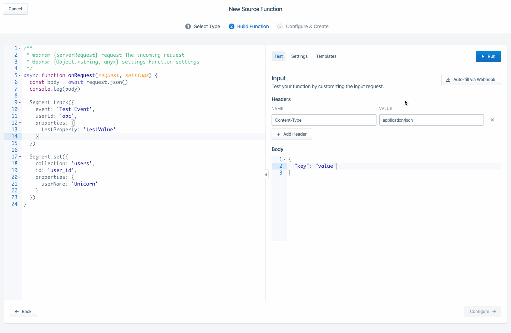
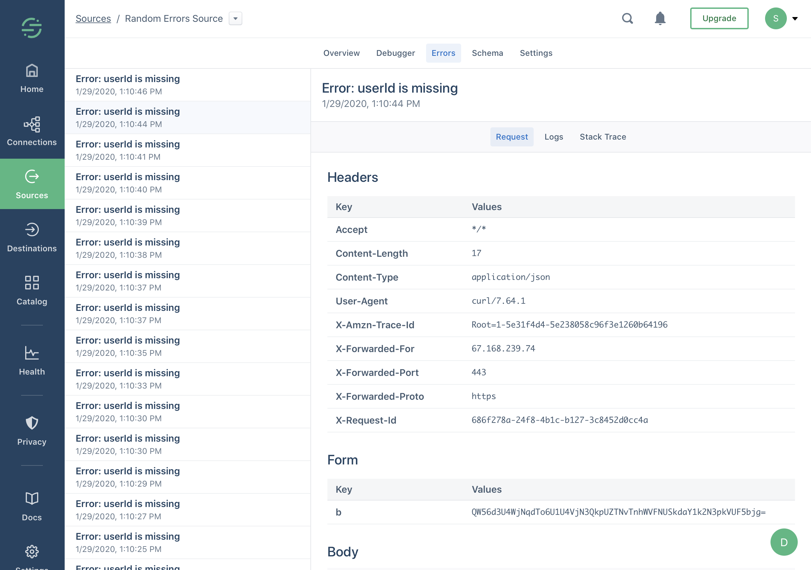
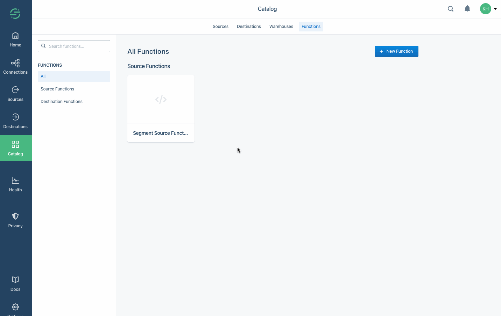

Source Functions allow you to gather data from any third-party applications without worrying about setting up or maintaining any infrastructure. 

Your function is a small piece of JavaScript code, scoped to your specific workspace, that can generate Segment events or objects using the [Segment Spec](/docs/connections/spec/).

**[VISUAL SHOWING DATA FLOW FROM UPSTREAM SOURCE TO FN TO SEGMENT]**

## Getting Started

### Creating your Source Function

1. From your Segment Workspace, to go the Catalog and click the [Functions tab](https://app.segment.com/goto-my-workspace/functions/catalog).
2. Click **New Function**.
3. Select **Source Function** and click **Build**.

### Writing your Function

> info ""
> **Tip:** Get started easily by referencing the templates available in the UI or in this open-sourced [Functions Library](https://github.com/segmentio/functions-library) - you're welcome to contribute too!

When you click the **Build** button, a JavaScript code editor opens, allowing you to configure your source logic that transforms a webhook payload into events or objects to be sent downstream. 


You can access the payload from the `request` variable like this:

```js
async function onRequest(request, settings) {
  const requestBody = request.json()
  const requestHeader = request.headers.get('Content-Type')
  const requestParam = request.url.searchParams.get("timestamp")

  // ...
}
```

Note that your handler function must be `async`.

The first `request` argument contains the incoming webhook request including headers and body. You access the request body through a `json()` or `text()` helper function, the request headers with the [Headers](https://developer.mozilla.org/en-US/docs/Web/API/Headers) interface, and the request URL and query parameters with the [URL](https://developer.mozilla.org/en-US/docs/Web/API/URL) interface.

#### Sending Messages

You can send messages to the Segment API using the `Segment` object:

```js
async function onRequest(request, settings) {
  Segment.identify({
    userId: '1234',
    traits: {
      traitName: 'Example Trait'
    }
  })

  Segment.track({
    event: 'Event Name',
    userId: '1234',
    properties: {
      propertyName: 'Example Property'
    }
  })

  Segment.group({
    userId: '1234',
    groupId: '1234',
    traits: {
      traitName: 'Example Trait'
    }
  })

  Segment.set({
    collection: 'collection_name_plural',
    id: 'object_id_string',
    properties: {
      propertyName: 'Example Property'
    }
  })
}
```

The `Segment` module has `Segment.identify()`, `Segment.track()`, `Segment.group()`, `Segment.set()`, `Segment.page()`, `Segment.screen()` and `Segment.alias()` functions. These fill in defaults and validate the data you provide. You can call these functions anywhere in your function.

Behind the scenes, the `Segment` module appends messages to an array and sends messages to the Segment [Tracking API](/docs/connections/sources/catalog/libraries/server/http/) and [Object API](/docs/connections/sources/catalog/libraries/server/object-api/), as long as your function returns without error.

##### Events

Events are used to trigger real-time workflows in downstream streaming destinations. These events are compatible with both streaming destinations and warehouses. Use the following return format for events from the function:

<table class="api-table">
  <tr>
    <td>Key</td>
    <td>Value Type</td>
    <td>Description</td>
  </tr>
  <tr>
    <td>event</td>
    <td>String</td>
    <td>The name of the event you want to fire. This is only valid for `Segment.track()`.</td>
  </tr>
  <tr>
    <td>userId</td>
    <td>String</td>
    <td>The user ID you want to associate the event with. If the type of the call is group then use the groupId.</td>
  </tr>
  <tr>
    <td>groupId</td>
    <td>String</td>
    <td>The Account or Group ID of the user. This is only valid for `Segment.group()`.</td>
  </tr>
  <tr>
    <td>properties</td>
    <td>Objects</td>
    <td>A list of key/value pairs that are sent as properties to the event. This is only valid for `Segment.track()`, `Segment.page()` and `Segment.()screen`.</td>
  </tr>
  <tr>
    <td>traits</td>
    <td>Objects</td>
    <td>A list of key/value pairs that are sent as traits to the event. This is only valid for `Segment.identify()` and `Segment.group()`.</td>
  </tr>
</table>

For more details on the events that are supported, see the [HTTP](/docs/connections/sources/catalog/libraries/server/http/) and [Object](/docs/connections/sources/catalog/libraries/server/object-api/) API documentation.

##### Objects

Objects are pieces of data that you can ETL (extract, transform, load) to your warehouse. Objects are not compatible with streaming destinations. For more details about what is supported with objects, review the [Objects API documentation](/docs/connections/sources/catalog/libraries/server/object-api/).

<table class="api-table">
  <tr>
    <td>Key</td>
    <td>Value Type</td>
    <td>Description</td>
  </tr>
  <tr>
    <td>collection</td>
    <td>String</td>
    <td>The collection translates to the name of the table in your warehouse. Examples: `products`, `rooms`, `leads`. Naming should be lower case and plural. </td>
  </tr>
  <tr>
    <td>id</td>
    <td>String</td>
    <td>The unique object ID. Any future objects with the same Object ID are upserted, de-duped and merged.</td>
  </tr>
  <tr>
    <td>properties</td>
    <td>Object</td>
    <td>A list of key/value pairs that are sent as properties of the object. These translate to columns downstream in your warehouse.</td>
  </tr>
</table>

### Runtime and Dependencies

Source Functions are run using Node.js 10.x. The following dependencies are pre-installed in the function environment. We don't currently support importing your own dependencies but please reach out to [our support team](https://segment.com/help/contact/) if you would like to request one to be added:


#### lodash

A modern JavaScript utility library delivering modularity, performance & extras. [See the lodash docs](https://lodash.com/docs/4.17.11).

#### AWS

The official Amazon Web Services SDK. [See the AWS docs](https://docs.aws.amazon.com/AWSJavaScriptSDK/latest/).

##### `fetch()`

The `fetch()` method starts the process of fetching a resource from the network, returning a promise which is fulfilled once the response is available. [See docs](https://developer.mozilla.org/en-US/docs/Web/API/WindowOrWorkerGlobalScope/fetch).

##### `Request`

The [`Request` interface](https://developer.mozilla.org/en-US/docs/Web/API/Request) of the Fetch API represents a resource request.

##### `Response`

The [`Response` interface](https://developer.mozilla.org/en-US/docs/Web/API/Response) of the Fetch API represents the response to a request.

##### `Headers`

The [`Headers` interface](https://developer.mozilla.org/en-US/docs/Web/API/Headers) of the Fetch API allows you to perform various actions on HTTP request and response headers. These actions include retrieving, setting, adding to, and removing. A Headers object has an associated header list, which is initially empty and consists of zero or more name and value pairs.

##### `URL`

The [`URL` interface](https://developer.mozilla.org/en-US/docs/Web/API/URL) is used to parse, construct, normalize, and encode URLs. It works by providing properties which allow you to easily read and modify the components of a URL.

##### `URLSearchParams`

The [`URLSearchParams` interface](https://developer.mozilla.org/en-US/docs/Web/API/URLSearchParams) defines utility methods to work with the query string of a URL.

##### `atob()`

The [`atob()` function](https://developer.mozilla.org/en-US/docs/Web/API/WindowOrWorkerGlobalScope/atob) decodes a string of data which has been encoded using base-64 encoding.

##### `btoa()`

The [`btoa()` method](https://developer.mozilla.org/en-US/docs/Web/API/WindowOrWorkerGlobalScope/btoa) creates a base-64 encoded ASCII string from a binary string.


#### form-data v2.4.0
... [See docs]().

#### oauth v0.9.15
... [See docs]().

#### xml v1.0.1
... [See docs]().


### Settings and Secrets

Settings allow you to pass configurable variables to your function. A common pattern is to configure settings for an API URL endpoint and secret API key, so that you can use the same code with different settings for different workspaces.

For example, if we include an `settingKey` string setting you will be able to access this in your code using dot notation on the settings object as follows:

```js
function onRequest(request, settings) {
  let settingValue = settings.settingKey;
}
```

You can include multiple setting types including strings, booleans, string arrays and string objects to support your use case. You can also mark a particular setting as being required and/or sensitive (encrypted), if needed.

Settings can help you build a function that can be reused without having to modify any code in the Function itself. For example, customers can use settings to:

- Build a function that can be rolled out without code changes to various Shopify stores
- Source payment data from a payment process and have a setting to denote the region for that function


## Testing

You can test your code directly from the Functions Editor in two ways:

### Webhook Catcher

Start by copying the webhook URL from the sidebar or "Auto-fill via webhook" dialog to your upstream tool or service. This allows you to receive payloads which you can use to test your function code.



Segment automatically listens to your webhook URL for any JSON events (for example `Content-Type: application/json`) which are triggered.

Click **Run** to test the event against your function code.

### Manual Input

You can also manually include your own JSON payload with relevant headers before you click **Run**. In this view, you also have the option to switch back to the webhook catcher by clicking **Auto-fill via Webhook**.

## Creation and Deployment

Once you finish writing your Source Function code, save the code and create the Function by clicking **Configure**. On the screen that appears, give the function a name, and optionally add useful details (these are displayed in your workspace). Click **Create Function** to finish and make your Destination Function available in your workspace.

If you're editing an existing function, you can **Save** changes without changing the behavior of your deployed function. Alternatively, you can also choose to **Save 
and Deploy** to push changes to an existing function.

## Logs and Errors

Your function may encounter errors that you missed during manual testing or you may intentionally throw your own errors in your code if, for example, the incoming request is missing required fields. If your function throws an error, execution is halted immediately and Segment captures the incoming request, any console logs you may have printed, as well as the error itself. Segment then displays the captured error information in the "Errors" tab of your Source in the Segment dashboard. You can use this tab to find and fix unexpected errors.



You can throw [an Error or custom Error](https://developer.mozilla.org/en-US/docs/Web/JavaScript/Reference/Global_Objects/Error) and you can also add additional helpful context in logs using the [`console` API](https://developer.mozilla.org/en-US/docs/Web/API/console). For example:

```js
async function onRequest(request, settings) {
  const requestBody = request.json()
  const userId = requestBody.userId

  console.log("userId:", userId)

  if (typeof userId != 'string' || userId.length < 8) {
    throw new Error("input user ID is invalid")
  }

  console.log("valid userId:", userId)

  // ...
}
```

> warning ""
> **Warning:** Do not log sensitive data, such as personally-identifying information (PII), authentication tokens, or other secrets. You should especially avoid logging entire request/response payloads. We only retain the 100 most recent errors and logs for up to 30 days but the "Errors" tab may be visible to other workspace members if they have the necessary permissions.

## Management

### Permissions

Functions have specific roles which can be leveraged for [access management](https://segment.com/docs/segment-app/iam/) within your Segment workspace.

The ability to create, edit and delete a function is dictated by two permission roles:

- **Functions Admin:** Create, edit and delete all functions or a subset of specified functions.
- **Functions Read-only:** View all functions or a subset of specified functions.

The permissions required to enable your Source Function or deploy changes to one already connected in your workspace require additional **Source Admin** permissions in addition to the role selected above.

### Editing and Deleting

If you are a **Workspace Owner** or **Functions Admin**, you can manage your Source Function from the [Functions tab](https://app.segment.com/goto-my-workspace/functions/catalog). Click the function tile and the panel that appears will allow you to connect, edit or delete your function.



### Connecting

As with [editing and deleting](/docs/connections/sources/source-functions/#editing--deleting), you must be a **Workspace Owner** or **Source Admin** in order to connect an instance of your function within your workspace. From the [Functions tab](https://app.segment.com/goto-my-workspace/functions/catalog), click on "Connect Source" and follow the flow to name and set it up in you workspace.

Next, you will see a webhook URL either under the "Overview" tab or under the "Settings" tab within "Endpoint". Copy and paste this URL into your upstream tool or service in order to receive data in this source.

## FAQs

**What is the retry policy for a webhook payload?**

The webhook payload retries up to 5 times with an exponential backoff for the function in the event of a failure with the function. After 5 attempts, the message is dropped.

**What is the maximum payload size for the incoming webhook?**

The maximum payload size for an incoming webhook payload is 2MB.

**What is the timeout for a function to execute?**

The execution time limit is 1 second.
