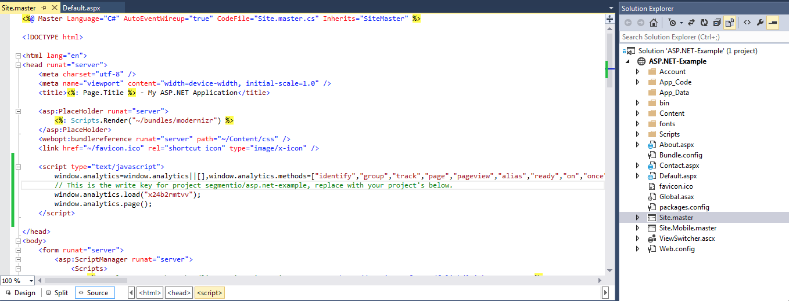
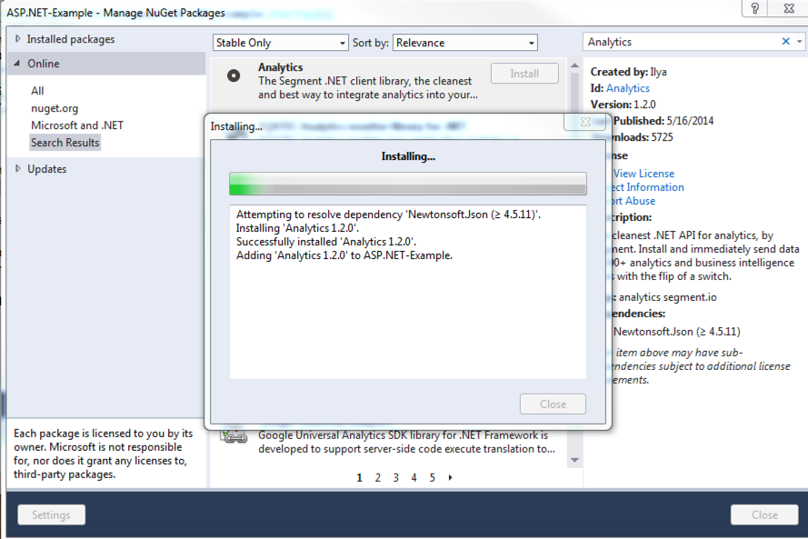

This tutorial will help you start sending analytics data from your ASP.NET app to Segment and any of our destinations, using our .NET and Analytics.js library. As soon as you're set up you'll be able to turn on analytics tools, ad conversion pixels, email tools and lots of other destinations with the flip of a switch!

If you want to dive deeper at any point, check out the [.NET library reference](/docs/connections/sources/catalog/libraries/server/net).


## Client-side vs Server-side

The best analytics installation combines both client-side and server-side tracking. A client-side analytics.js installation allows you to install A/B testing, heat mapping, session recording, and ad optimization tools. A server-side .NET installation allows you to accurately track events that aren't available client-side, such as payments. For best practices, [check out our guide client-side vs. server-side](/docs/guides/how-to-guides/collect-on-client-or-server/).


## Step 1: Create a Source in the Segment app

Before you begin, you need a Workspace (which is a container that holds all of the sources and destinations which are billed together for an organization). If you already created one, great! If not, you can sign up for a free Segment account and create one.

Next, create a .NET source from your Workspace:

1. Click **Add Source**.
2. From the source catalog page, click **.NET**.
3. Click **Add Source** again from the informational panel that appears to the right.
4. Give the source a display name, and add any labels for the source.

When you create a Source in the Segment web app, it tells the Segment servers that you'll be sending data from a specific source type. When you create (or change!) a Source in the Segment app, Segment generates a new Write Key for that source. You use the write key in your code to tell the Segment servers where the data is coming from, so Segment can route it to your destinations and other tools.

## Step 2: Add Analytics.js to your ASP.NET Master Page

Once you create a source from the Segment web app, you next [copy the Analytics.js snippet](/docs/connections/sources/catalog/libraries/website/javascript/quickstart/#step-2-copy-the-segment-snippet) into your project. You can copy the snippet directly into your ASP.NET [Site.master](https://github.com/segmentio/asp.net-example/blob/master/Site.master#L18-L21):



That snippet loads Analytics.js onto the page _asynchronously_, so it won't affect your page load speed. As soon as that snippet is running on your site, you can start enabling destinations from your Segment destinations page and they start loading on your site automatically! In fact, if you reload, you can start seeing `Page` calls in the [Segment debugger](/docs/connections/sources/debugger/) almost immediately.

**Fun fact:** if you only want the most basic Google Analytics set up you can stop reading right now. You're done! Just switch on Google Analytics in our interface.

For a more in depth Analytics.js tutorial, check out the [Analytics.js quickstart guide](/docs/connections/sources/catalog/libraries/website/javascript/quickstart).

Lots of analytics and marketing tools want to know more information about your users, and what they're doing on your app. In the next section, we'll install the .NET library and start sending an event every time a new user registers on your site.


## Step 3: Install our .NET Library

Your website will use our .NET library to identify and track users. You can use the handy-dandy NuGet to easily install the .NET library in your ASP.NET solution:

```
Install-Package Analytics -Version <version>
```

You can also accomplish the same thing in the `Manage NuGet Packages` menu of Visual Studio:



Nice! Now the .NET library needs to know which Segment project you want to send data to. You can initialize the library with your Segment project's `writeKey` in the [Global.asax file](https://github.com/segmentio/asp.net-example/blob/master/Global.asax#L14). Then you can use the `Analytics` singleton in any controller you want.:

```dotnet
<%@ Application Language="C#" %>
<%@ Import Namespace="ASP.NET_Example" %>
<%@ Import Namespace="System.Web.Optimization" %>
<%@ Import Namespace="System.Web.Routing" %>
<%@ Import Namespace="Segment" %>

<script runat="server">

    void Application_Start(object sender, EventArgs e)
    {
        RouteConfig.RegisterRoutes(RouteTable.Routes);
        BundleConfig.RegisterBundles(BundleTable.Bundles);
        // this is your project's write key
        Segment.Analytics.Initialize("x24b2rmtvv");
    }

</script>
```

Now you're ready to track your first server-side ASP.NET user event.


## Step 4: Track Your First ASP.NET Event

Our example ASP.NET site has a login and a register page. You'll want to identify users and track signups from the server-side because it gives you the most accurate count. Other server-side events like `Order Completed` should be tracked server-side as well.

To identify newly registered users, we'll use the `identify` and `track` call in the [Register.aspx.cs](https://github.com/segmentio/asp.net-example/blob/master/Account/Register.aspx.cs#L18-L24) controller.

> note ""
> **Good to know**: For any of the different methods described in this quickstart, you can replace the properties and traits in the code samples with variables that represent the data collected.

```csharp
Analytics.Client.Identify(user.Id, new Segment.Model.Traits
{
    { "name", user.UserName },
    { "email", user.Email }
});
Analytics.Client.Track(user.Id, "Signup");
```

Congratulations! You can now track any event from the browser and the backend. Hundreds of analytics tools await you. If you register a new user in the site, you'll see the `identify` and `track` calls in the debugger.


## What's Next?

We just walked through the quickest way to get started with Segment using Analytics.js and the .NET library. You might also want to check out our full [Analytics.js reference](//docs/connections/sources/catalog/libraries/website/javascript/) to see what else is possible, or read about the [Tracking API methods](/docs/connections/spec/) to get a sense for the bigger picture.

If you're running an **Ecommerce** site or app you should also check out our [Ecommerce API reference](/docs/connections/spec/ecommerce/v2/) to make sure your products and checkout experience is instrumented properly!
