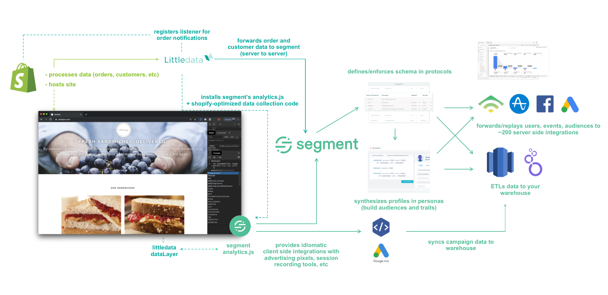
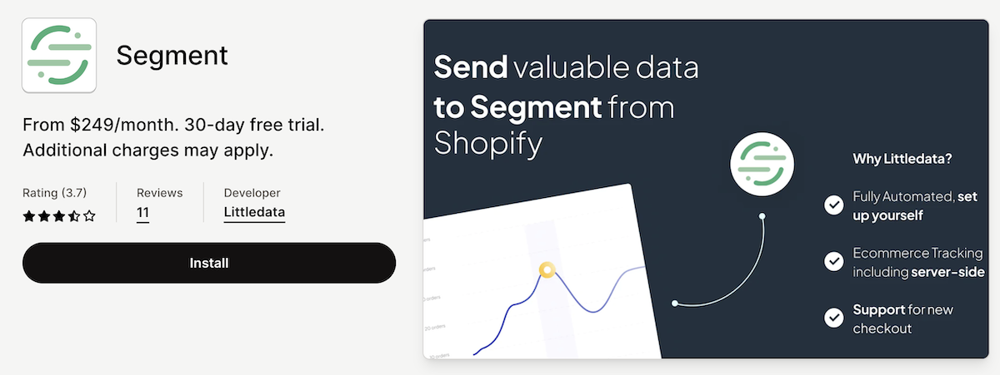

<!-- LR Note: the working copy of the source catalog YML we built on showed this in the `website` source though as of Nov 18 it's labeled cloud-source -->

Littledata is a smart analytics app that automates ecommerce tracking. Littledata's [Shopify-to-Segment connection](https://blog.littledata.io/help/posts/segment-overview/?utm_source=segmentio&utm_medium=docs&utm_campaign=partners) automatically tracks key ecommerce events on a Shopify or Shopify Plus store, so you can use Shopify as a source in your Segment workspace.

Littledata is available as an independent [Shopify App](https://apps.shopify.com/segment-com-by-littledata). When you install the Littledata app on your store, Littledata does two things:

1. It inserts a smart tracking script to your store's front end. This script can be used with any custom Shopify site, and uses analytics.js under the hood to send data in a spec-compliant manner to Segment.

2. The app also sets up server-side webhook forwarding to ensure 100% accuracy of important Customer and Order data.

Here's an architecture diagram that shows how the Littledata app mediates data flow between Shopify and Segment.

> warning "Note"
> This integration is maintained by Littledata _and is not supported by Segment directly_. The Littledata app has been reviewed by the Segment team for conformance with our [E-Commerce Spec](/docs/connections/spec/ecommerce/v2/), and is our recommended way of using Segment with Shopify. However, it does require a paid subscription with Littledata, who mediates the connection between Shopify and Segment. [Contact the Littledata Support team](mailto:support@littledata.io) with any questions.

## Getting Started

1. **Login** to your Shopify Store account.
2. Go the [Shopify app store listing](https://apps.shopify.com/segment-com-by-littledata) for **_Segment.com by Littledata_**.
   
3. Click **Add app** to begin the installation process.
4. **Sign up** for a Littledata account using an email address, Google login or Facebook login. _More team members can be added to the subscription after completing the installation process._
5. Add the [**Segment write key**](/docs/connections/find-writekey/) for the source that is going to send data in the **input field**.
   
6. Choose either an **Automatic** or a **Manual** install. _Automatic installs work in most instances, but if you choose to do a manual install, just follow [this guide](https://blog.littledata.io/help/posts/segment-installation-guide/)._
   
7. Segment's **analytics.js** library, Littledata **tracking script** and **webhooks** will be automatically applied to the store and the installation proccess will then be complete.
   

## Device-mode Events

Below is a table of events that **Shopify by Littledata** sends to Segment via the analytics.js libary. These events will show up as tables in your warehouse, and as regular events in your other Destinations supporting device-mode.

<table>
  <tr>
   <td>Event Name</td>
   <td>Description</td>
  </tr>
  <tr>
   <td>Page Viewed</td>
   <td>User has viewed a page</td>
  </tr>
  <tr>
   <td>Product List Viewed</td>
   <td>User has viewed a product as they scroll down the collection page</td>
  </tr>
  <tr>
   <td>Product Clicked</td>
   <td>User has clicked a product within a product list</td>
  </tr>
  <tr>
   <td>Product Viewed</td>
   <td>User has viewed a product page</td>
  </tr>
  <tr>
  <tr>
   <td>Product Image Clicked</td>
   <td>User has clicked a product image</td>
  </tr>
  </table>
 

In addition to the events tracked as standard, the following hits can be tracked based on page path:

<table>
  <tr>
   <td>Event Name</td>
   <td>Description</td>
  </tr>
  <tr>
   <td>Registration Viewed</td>
   <td>Prospect has viewed the registration page</td>
  </tr>
  <tr>
   <td>Cart Viewed</td>
   <td>Prospect has viewed the cart</td>
  </tr>
  <tr>
   <td>Blog Viewed</td>
   <td>Prospect has viewed the blog</td>
  </tr>
  <tr>
   <td>Registration Completed</td>
   <td>Prospect has completed registration</td>
  </tr>
</table>

## Cloud-mode events

Below is a table of events that **Shopify by Littledata** sends to Segment via Littledata's servers. These events will show up as tables in your warehouse, and as regular events in your other Destinations supporting cloud-mode. They will include the `anonymousId` linking them to the device-mode events where the event was part of a previous user session, or associated with a `userId` that was previously linked with an `anonymousId`. See Littledata's [troubleshooting guide on attribution](https://blog.littledata.io/help/posts/troubleshooting-marketing-attribution-for-shopify/) for more details.

  <table>
  <tr>
   <td>Event Name</td>
   <td>Description</td>
  </tr>
  <tr>
   <td>Product Added</td>
   <td>User has added a product to the cart, and left it in the cart for more than 10 seconds</td>
  </tr>
  <tr>
   <td>Product Removed</td>
   <td>User has removed a product from the cart</td>
  </tr>
  <tr>
   <td>Checkout Started</td>
   <td>User has started checkout</td>
  </tr>
  <tr>
   <td>Checkout Step Completed</td>
   <td>User has completed a step in the checkout </td>
  </tr>
  <tr>
   <td>Payment Info Entered</td>
   <td>User has entered payment info</td>
  </tr>
  <tr>
   <td>Order Completed</td>
   <td>Prospect has completed an order</td>
  </tr>
  <tr>
   <td>Order Refunded</td>
   <td>Order has been refunded</td>
  </tr>
  <tr>
    <td>Order Cancelled (v2)</td>
   <td>Admin has cancelled an order (including the <code>cancel_reason</code>)</td>
  </tr>
  <tr>
    <td>POS Order Placed (v2)</td>
    <td>User has placed an order via Shopify POS</td>
  </tr>
  <tr>
    <td>Payment Failure (v2)</td>
    <td>User completed checkout step 3 but the payment method failed (i.e. the card details were valid but the <a href="https://stripe.com/docs/testing#cards-responses">charge did not succeed</a>)</td>
  </tr>
  <tr>
    <td>Customer Enabled (v2)</td>
    <td>User has confirmed their email address and created a Shopify customer account with <code>verified_email</code> set as true</td>
  </tr>
  <tr>
    <td>Fulfilment Update (v2)</td>
    <td>Order fulfilment status has changed (including <code>status</code>, <code>tracking_numbers</code> and <code>tracking_urls</code> where the shipping integration allows)</td>
  </tr>
</table>
 

## Identify calls

For every event where there is an identifiable Shopify customer (from both the device-mode and cloud-mode) we also send an Identify call. This happens when the customer logs into the storefront, on the last step of the checkout, with the order, and also after purchase with any customer update in Shopify admin.

The following traits are included with an Identify call:

<table>
<tr>
<td><strong>Property Name</strong></td>
<td><strong>Description</strong></td>
<td><strong>Property Type</strong></td>
</tr>
<tr>
<td>userId</td>
<td>Shopify Customer ID</td>
<td>Double</td>
</tr>
<tr>
<td>firstName</td>
<td>Customer's first name</td>
<td>String</td>
</tr>
<tr>
<td>lastName</td>
<td>Customer's email</td>
<td>String</td>
</tr>
<tr>
<td>email</td>
<td>Customer's email address</td>
<td>String</td>
</tr>
<tr>
<td>phone</td>
<td>Customer's phone number</td>
<td>String</td>
</tr>
<tr>
<td>createdAt</td>
<td>Date customer record was created</td>
<td>Date</td>
</tr>
<tr>
<td>description</td>
<td>Customer notes</td>
<td>String</td>
</tr>
<tr>
<td>address</td>
<td>Customer's primary address</td>
<td>String</td>
</tr>
<tr>
<td>customerLifetimeValue</td>
<td>Total spend of customer on the Shopify store</td>
<td>Double</td>
</tr>
<tr>
<td>purchaseCount</td>
<td>Number of orders by this customer</td>
<td>Integer</td>
</tr>
<tr>
<td>marketingOptIn</td>
<td><code>marketing_opt_in</code> field from <a href="https://shopify.dev/docs/admin-api/rest/reference/customers/customer?api[version]=2020-04" target="_blank" rel="noopener noreferrer">Shopify customer</a></td>
<td>String</td>
</tr>
<tr>
<td>tags</td>
<td><a href="https://shopify.dev/docs/admin-api/rest/reference/customers/customer?api[version]=2020-04" target="_blank" rel="noopener noreferrer">Custom tags</a> applied to the customer</td>
<td>String</td>
</tr>
<tr>
<td>state</td>
<td>Whether the customer account is <code>enabled</code> or <code>disabled</code></td>
<td>String</td>
</tr>
<tr>
<td>verified_email (v2)</td>
<td>Whether the customer has verified their email</td>
<td>Boolean</td>
</tr>
</table>

## Alias calls

To support seamless customer tracking the [Mixpanel](/docs/connections/destinations/catalog/mixpanel/#alias), [Vero](/docs/connections/destinations/catalog/vero/#alias) and [KISSMetrics](docs/connections/destinations/catalog/kissmetrics/#alias) destinations, Littledata ensures the pre-checkout `anonymousId`is added as an alias of the `userId` (used from checkout step 2 onwards).

## Subscription ecommerce events

Additional events available via Littledata's [ReCharge connection](https://www.littledata.io/connections/recharge), and available in cloud-mode destinations.

<table>
<tr>
<td><strong>Event Name</strong></td>
<td><strong>Description</strong></td>
</tr>
<tr>
<td>Subscription Created</td>
<td>Customer has created a subscription</td>
</tr>
<tr>
<td>Subscription Updated</td>
<td>Customer has updated a subscription</td>
</tr>
<tr>
<td>Subscription Cancelled</td>
<td>Customer has cancelled a subscription</td>
</tr>
<tr>
<td>Order Processed</td>
<td>Recurring order has been processed</td>
</tr>
<tr>
<td>Charge Failed</td>
<td>Failed to charge customer</td>
</tr>
<tr>
<td>Charge Max Tries Reached</td>
<td>Maximum tries to charge customer has been reached</td>
</tr>
<tr>
<td>Payment Method Updated</td>
<td>Customer has updated the payment method</td>
</tr>
<tr>
<td>Customer Update</td>
<td>Customer information updated</td>
</tr>
</table>

## Event Properties

Below are tables outlining the properties included in the events listed above.

<table>
<tr>
<td><strong>Property</strong></td>
<td><strong>Description</strong></td>
<td><strong>Property Type</strong></td>
</tr>
<tr>
<td>userId</td>
<td>Shopify Customer ID (after checkout step 2)</td>
<td>Double</td>
</tr>
<tr>
<td>email</td>
<td>Shopify email address (after checkout step 2)</td>
<td>String</td>
</tr>
<tr>
<td>order_id</td>
<td>ID of the order</td>
<td>String</td>
</tr>
<tr>
<td>checkoutId</td>
<td>ID of the checkout session</td>
<td>String</td>
</tr>
<tr>
<td>shipping</td>
<td>Shipping cost</td>
<td>Float</td>
</tr>
<tr>
<td>tax</td>
<td>Order tax</td>
<td>Float</td>
</tr>
<tr>
<td>total</td>
<td>Total value of the order</td>
<td>Float</td>
</tr>
<tr>
<td>affiliation</td>
<td>Affiliation of the order</td>
<td>String</td>
</tr>
<tr>
<td>coupon</td>
<td>Discount coupon</td>
<td>String</td>
</tr>
<tr>
<td>currency</td>
<td>Currency of the order</td>
<td>String</td>
</tr>
<tr>
<td>discount</td>
<td>Discounted amount</td>
<td>Float</td>
</tr>
<tr>
<td>products</td>
<td>List of all the product details</td>
<td>Array</td>
</tr>
<tr>
<td>category</td>
<td>Category of the product</td>
<td>String</td>
</tr>
<tr>
<td>brand</td>
<td>Brand of the product</td>
<td>String</td>
</tr>
<tr>
<td>list_id</td>
<td>ID of the product collection</td>
<td>String</td>
</tr>
<tr>
<td>list_name</td>
<td>Name of the product collection</td>
<td>String</td>
</tr>
<tr>
<td>list_position</td>
<td>Product position in the collection</td>
<td>Integer</td>
</tr>
<tr>
<td>name</td>
<td>Product name</td>
<td>String</td>
</tr>
<tr>
<td>price</td>
<td>Product price</td>
<td>Float</td>
</tr>
<tr>
<td>product_id</td>
<td>Shopify product ID (also called <code>shopify_product_id</code> on client side)</td>
<td>String</td>
</tr>
<tr>
<td>sku</td>
<td>Product SKU</td>
<td>String</td>
</tr>
<tr>
<td>variant</td>
<td>Product variant name</td>
<td>String</td>
</tr>
<tr>
<td>variants</td>
<td>Property that holds product variant IDs and SKUs</td>
<td>String</td>
</tr>
<tr>
<td>shopify_variant_id</td>
<td>Shopify variant ID</td>
<td>String</td>
</tr>
<tr>
<td>quantity</td>
<td>Quantity of the product</td>
<td>Integer</td>
</tr>
<tr>
<td>step</td>
<td>Checkout step</td>
<td>Integer</td>
</tr>
<tr>
<td>paymentMethod</td>
<td>Payment method chosen for checkout</td>
<td>String</td>
</tr>
<tr>
<td>shipping_method</td>
<td>Shipping method chosen for checkout</td>
<td>String</td>
</tr>
<tr>
<td>context.Google Analytics.clientId</td>
<td>User's Google Analytics Client ID</td>
<td>String</td>
</tr>
<tr>
<td>context.Google Analytics.geoid</td>
<td>User's location</td>
<td>String</td>
</tr>
<tr>
<td>context.uip</td>
<td>User IP address</td>
<td>String</td>
</tr>
<tr>
<td>sent_from</td>
<td>Unique property to identify events sent by Littledata</td>
<td>String</td>
</tr>
<tr>
<td>presentment_currency</td>
<td>User's local currency</td>
<td>String</td>
</tr>
<tr>
<td>presentment_total</td>
<td>Order total in local currency</td>
<td>String</td>
</tr>
</table>
