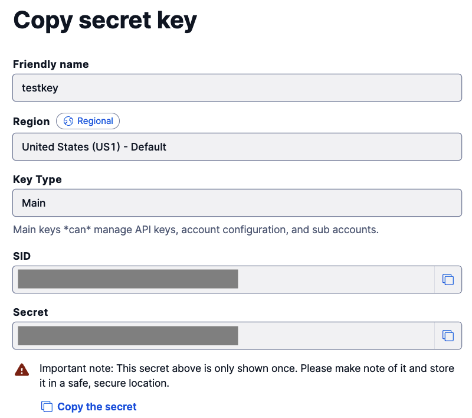
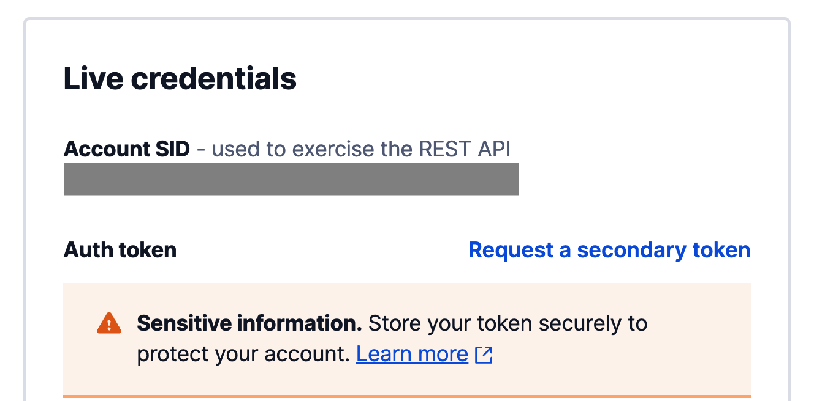
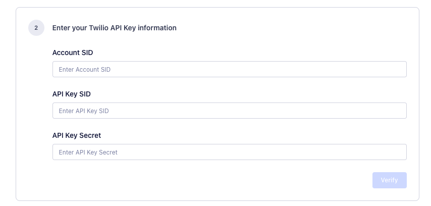
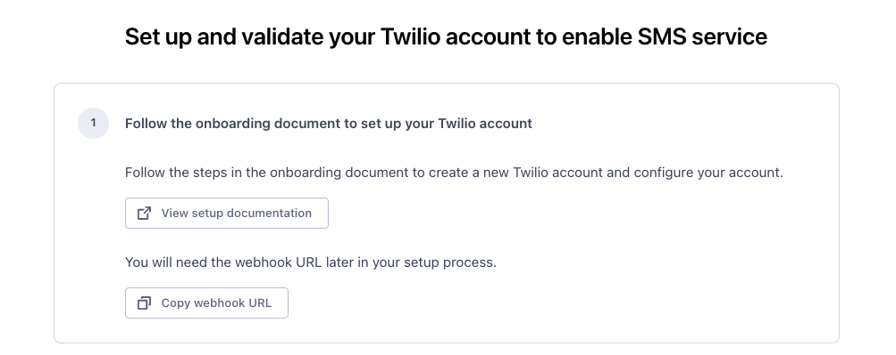
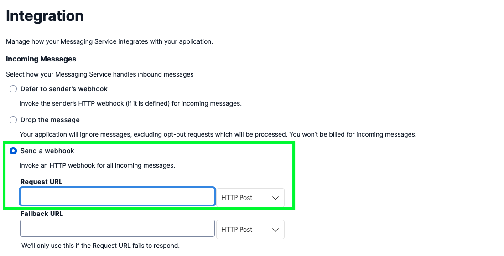

Twilio Engage brings Segment, Twilio, and SendGrid together to help you create and send email and SMS campaigns to your customers.

Before sending your first Engage campaign, though, you’ll need to configure and connect accounts with all three platforms.

This guide lists all required onboarding steps and walks you through Engage setup. By the end of the onboarding process, you’ll be ready to send your first campaign.

> info ""
> The steps in this guide are only required if you plan to send email and SMS messages with Engage. Visit the [Engage Foundations Onboarding Guide](/docs/engage/quickstart) for general onboarding steps to set up your Engage space, connect sources, create audiences, and more.

## Before you begin: overview and task checklist

You’ll set up Twilio Engage in three stages:

1. [Configure Engage identifiers in Profiles.](/docs/engage/onboarding/#stage-1-configure-engage-identifiers-in-profiles)
2. [Create and configure a SendGrid account.](/docs/engage/onboarding/#stage-2-create-and-configure-a-sendgrid-account)
3. [Create and configure Twilio SMS services.](/docs/engage/onboarding/#stage-3-create-and-configure-twilio-sms-services)

The following table shows a high-level checklist of tasks you’ll need to complete in each platform:

| Platform | Tasks                                                                                                                                                                                                                                                                                                                                                                                              |
| -------- | -------------------------------------------------------------------------------------------------------------------------------------------------------------------------------------------------------------------------------------------------------------------------------------------------------------------------------------------------------------------------------------------------- |
| Segment  | 1. Verify Engage identifiers in your Segment workspace.   2. Add any missing identifiers.                                                                                                                                                                                                                                                                                                      |
| SendGrid | 1. Create a SendGrid account.   2. Upgrade your account to a Pro plan.   3. Configure an IP.   4. Create a SendGrid subuser.   5. Authenticate your domain.   6. Enable subscription tracking.   7. Enable an event webhook.   8. Generate API credentials, then copy them into Engage settings.   9. Enable automated IP warmup.   10. Contact Segment support. |
| Twilio   | 1. Create a Twilio account.   2. Purchase phone number(s).   3. If necessary, register phone number(s).   4. Create a messaging service.   5. Generate an API key, then copy it into the Engage settings.   6. Configure an event webhook.                                                                                                                                                                                      |

Several onboarding steps require copying and pasting information between Segment and SendGrid or Twilio. To streamline setup, open your Segment workspace in one browser tab and open two others for tasks you’ll carry out in SendGrid and Twilio.

Continue reading for a detailed, step-by-step breakdown of each onboarding stage.

## Stage 1: Configure Engage Identifiers in Profiles

Through [identity resolution](/docs/profiles/identity-resolution/), Segment uses the `phone` and `email` traits to identify users who can receive your Engage campaigns. To begin using Engage, you’ll need to verify that these identifiers exist in your workspace and add them if they don’t.

Follow these steps to configure the traits:

1. In your Segment workspace, navigate to **Profiles > Profiles settings > Identity resolution**.
2. Under the Identity resolution configuration table, verify that `phone` and `email` appear under the **Identifier** column. If so, the Engage identifiers are configured correctly; skip to [create and configure a SendGrid account](#stage-2-create-and-configure-a-sendgrid-account).
3. If either identifier is missing, click the **Add identifier** button, then click **Custom identifiers**.
4. In the **New Custom Identifier** modal, add the first missing trait (`phone` or `email`) in the **Trait/Property key** field, then click **Add Identifier**.
5. If both traits were missing, repeat Step 4 and add the other missing trait (`phone` or `email`). Finish by clicking **Add New Identifier**.

Your Segment workspace is now configured for Engage.  Next, you’ll create a SendGrid account and connect it to Segment.

## Stage 2: Create and configure a SendGrid account

SendGrid powers delivery of your Engage email campaigns. During this stage of onboarding, you’ll create and set up a SendGrid Pro account. You’ll then configure SendGrid and Engage to enable both subscription tracking and an event webhook.

### Create your SendGrid Pro account

Start by creating a SendGrid account and then upgrading to the SendGrid Pro Plan:

1. Visit the [SendGrid website](https://sendgrid.com/){:target="_blank"} and sign up for an account.
2. Within your SendGrid space, navigate to **Settings > Account Details > Your Products**.
3. Under the **Email API** section, select **Change Plan**.
4. On the Email API Plans page, select a Pro option that fits your anticipated sending needs.
5. Add the Pro option to your cart, and complete checkout.

> info "Upgrading to SendGrid Pro"
> Upgrading to a SendGrid Pro account may require additional action on your part. Follow the instructions in [SendGrid's account upgrade guide](https://support.sendgrid.com/hc/en-us/articles/1260802642689-Unable-to-Upgrade-a-SendGrid-Account){:target="_blank"} to complete your upgrade.

### Create a subuser and check the dedicated IP address

Next, you’ll create a SendGrid subuser and ensure that a dedicated IP has been assigned:

1. In your SendGrid space, navigate to **Settings > Subuser Management**, then click **Create New Subuser**.
2. In the **Create New Subuser** window, create a username for the subuser, then add an email address and password. Your SendGrid subuser username must begin with the prefix `twilio_engage_app_`. Add a unique identifier to the end of the prefix, for example, `twilio_engage_app_someusername`.

    

3. In the same window, click the checkbox next to the dedicated IP address you'll user for the subuser. Segment recommends that you choose an IP address that you'll only use for Engage.
4. Fill out the remaining fields in the window, then click **Create Subuser**.
5. Using [SendGrid’s documentation](https://docs.sendgrid.com/ui/account-and-settings/dedicated-ip-addresses){:target="_blank"}, warm up the IP address.

### Authenticate your domain

> info "SendGrid parent account"
> In this section, you'll authenticate your domain and set up reverse DNS with your SendGrid parent account.

Now, you’ll authenticate your domain with SendGrid and your DNS provider and [enable link branding](https://docs.sendgrid.com/ui/account-and-settings/how-to-set-up-link-branding){:target="_blank"}. Domain authentication protects your sending reputation by showing email providers that you’ve given SendGrid permission to send email campaigns for you.

To authenticate your domain, you’ll copy CNAME records given to you by SendGrid and paste them into your DNS provider. **Before you begin, verify that you have the necessary permissions to add CNAME records to your DNS.** If you’re not sure if you have the right permissions, reach out to your organization’s IT department.

You’ll authenticate your domain using the SendGrid platform and your DNS provider:

1. **From your SendGrid parent account**, follow [SendGrid’s domain authentication guide](https://docs.sendgrid.com/ui/account-and-settings/how-to-set-up-domain-authentication){:target="_blank"}.
2. During the authentication process, SendGrid asks if you would like to brand links for your domain. Select **Yes**.
3. SendGrid provides you with five CNAME records.  Add them to your DNS host.
4. Return to SendGrid and [verify your DNS](https://docs.sendgrid.com/ui/account-and-settings/how-to-set-up-domain-authentication#verifying-your-dns){:target="_blank"}.

Complete authentication by setting up reverse DNS:

1. **From your SendGrid parent account**, follow [SendGrid’s reverse DNS (rDNS) documentation](https://docs.sendgrid.com/ui/account-and-settings/how-to-set-up-reverse-dns){:target="_blank"}.
2. SendGrid provides you with one A record. Add it to your DNS host, along with the five CNAME records from the previous steps.
3. Return to SendGrid and [verify your DNS](https://docs.sendgrid.com/ui/account-and-settings/how-to-set-up-reverse-dns#verifying){:target="_blank"}.

### Enable subscription tracking

You'll also need to enable [subscription tracking](https://docs.sendgrid.com/ui/sending-email/subscription-tracking){:target="_blank"}, which keeps records of users who unsubscribe from your email campaigns:

1. Within your SendGrid space, navigate to **Settings > Tracking**.
2. On the **Tracking Settings page**, click **Subscription Tracking** in the **Settings** column.
3. At the end of the Subscription Tracking window, toggle **Setting State** to `enabled`. Click **Save**.

### Enable event webhook

> info "Subuser Step"
> This step takes place in the **subuser** space.

You’ll now need to enable event webhooks, which trigger webhook notifications for campaign-related events like clicks and opens:

1. Within your SendGrid **subuser** space, navigate to **Settings > Mail Settings**.
2. Click the pencil edit icon next to **Event Webhook**.
3. On the Event Webhook page, set authorization method to none.
4. Copy and paste the following URL into the **HTTP Post URL** field:

      `https://engage-ma-webhook-api.engage.segment.com/sendgrid`

    

5. Check **Select All** under both **Deliverability Data** and **Engagement Data**.
6. Toggle the Event Webhook Status to `Enabled`. Click **Save**.

### Generate an API key

> warning "Copying SendGrid Credentials"
> This step creates an API key and API Key ID that you’ll immediately add to Segment. Make sure you’re ready to copy and save the API key before proceeding; SendGrid only displays the API key once. You must follow these steps from within the SendGrid subuser account [you created for use with Twilio Engage](/docs/engage/onboarding/#create-a-subuser-and-check-the-dedicated-ip-address).

Now, you'll generate an API key and API Key ID within SendGrid. **With your SendGrid account open in one tab, open your [Segment workspace](https://app.segment.com/workspaces){:target="_blank"} open in another. You’ll need both open to copy and paste the API credentials it into your Engage settings.**

1. Within your SendGrid subuser space, navigate to **Settings > API Keys**.
2. Click the **Create API Key** button.
3. In the Create API Key window, name your API key using the prefix `twilio_engage_app_`, with a suffix of your choice added to the end, like `twilio_engage_app_somekey`.
4. Under API Key Permissions, select the **Full Access** radio button, then click **Create & View**.
5. SendGrid displays your API Key. **Click the API key to copy it to your computer’s clipboard**, then select **Done**.
6. SendGrid returns you to the API Keys page; leave this tab open.

To finish linking the API credentials to your Segment account, follow these steps:

1. Switch to the browser tab with your Segment workspace open.
2. Navigate to **Engage > Engage settings > Channels**. Under **Email Service with SendGrid**, select the **Get Started** button.
3. In the **Set up and validate your SendGrid account** window (shown below), enter the subuser username [you previously created](#create-a-subuser-and-check-the-dedicated-ip-address) into the **Subuser Name** field.
4. Paste the Subuser API Key you just copied from SendGrid into the **Subuser API Key** field. Leave this tab open.
5. Return to the tab showing your SendGrid API Keys. **Copy the key displayed after API Key ID.**
6. Return to the tab with your Segment workspace. Paste the copied API Key ID into the **Subuser API Key ID** field.
7. Click **Verify**.

  

### Enable Automated IP warmup

> info "Required Step"
> Notify Segment support once you've completed IP warmup.

To finish configuring your SendGrid account for usage with Twilio Engage, you’ll enable [automated IP warmup](https://docs.sendgrid.com/ui/sending-email/warming-up-an-ip-address){:target="_blank"}. As a best practice, **only warm up your IP when you're ready to begin sending campaigns.**

To enable IP warmup, follow these directions:

1. Within your SendGrid space, navigate to **Settings > IP Addresses**.
2. On the **Dedicated IP Addresses** page, click the pencil edit button next to your Engage IP address.
3. Under **Additional options** (pictured below), check **Use Automated IP warmup** and **Allow my subusers to send mail using this IP address**. Click **Save**.
4. **Required: Reach out to Segment support. Let them know you’ve enabled IP warmup.**

Your SendGrid account is now fully configured and ready to use with Engage.  You’re ready to move to Stage 3 and configure Twilio SMS.

## Stage 3: Create and configure Twilio SMS services

To add the ability to send SMS campaigns in Engage, you’ll now create a Twilio account, generate an API key, set up a phone number and messaging service, and configure event webhooks.

### Create a Twilio account and generate an API key

> info "Copying Twilio Credentials"
> This step generates an Account SID, API key SID, and API key secret that you’ll later add to Segment. Make sure you’re ready to copy and save both proceeding.

Start by creating your Twilio account and getting an API key for Engage:

1. Visit the [Twilio website](https://www.twilio.com/try-twilio){:target="_blank"} and sign up for a **paid account**. Trial accounts generate sending errors.
2. In your Twilio console, select the **Account** dropdown menu, then **API keys & tokens**.
3. On the Auth tokens & API keys page, click **Create API key**.
4. Enter a name for the API key in the **Friendly name** field.
5. Set the region to **United States (US1) - Default** and key type to **Main**.
6. Click **Create API Key**.
7. Copy and save both the **SID** and **Secret** field contents.

    

8. Return to the API keys & tokens page. In the **Live credentials** section, copy the Account SID credentials.

    

9. Switch to the browser tab with your Segment workspace.
10. Navigate to **Engage > Engage settings > Channels**.  Under **SMS Service with Twilio**, click the **Get Started** button. The **Set up and validate your Twilio account** page appears.
11. Under **Enter your Twilio API Key information** (shown below), paste the Account SID, API Key SID, and API Key Secret you copied above into their corresponding fields.
12. Click **Verify**, then click **Save Twilio Account.**

  

> info ""
> If you’re unable to verify your Account SID, SID, or API Key secret, you may have copied an extra space at the end of one or the other. Verify that you’ve not added any extra characters or spaces, then try to verify again.

### Set up a Twilio Messaging Service

> info "Phone Number Registration"
> You'll need to purchase a phone number to set up [Twilio Messaging](https://support.twilio.com/hc/en-us/articles/360038173654-Comparison-of-SMS-messaging-in-the-US-and-Canada-for-long-codes-short-codes-and-toll-free-phone-numbers){:target="_blank"}. Depending on the phone number type you purchase, you may have to register the number. Before completing this section, read Twilio's documentation on [short code](https://www.twilio.com/docs/glossary/what-is-a-short-code){:target="_blank"}, [long code](https://support.twilio.com/hc/en-us/articles/1260800720410-What-is-A2P-10DLC-){:target="_blank"}, and [toll free numbers](https://support.twilio.com/hc/en-us/articles/360038172934-Information-and-best-practices-for-using-Toll-Free-SMS-and-MMS-in-the-US-and-Canada){:target="_blank"}.

Once you've identified the type of phone number you'll use with Twilio Engage, follow these steps to create a Twilio Messaging Service:

1. [Purchase a phone number](https://support.twilio.com/hc/en-us/articles/223135247-How-to-Search-for-and-Buy-a-Twilio-Phone-Number-from-Console){:target="_blank"} within your Twilio Console. If necessary, [register the number](https://support.twilio.com/hc/en-us/articles/1260801864489-How-do-I-register-to-use-A2P-10DLC-messaging-){:target="_blank"}.
2. In the Twilio Console side menu, navigate to **Messaging > Services**.
3. On the Messaging Services page, click **Create Messaging Service**.
4. Enter a name for your Messaging Service.
5. Under the Messaging use dropdown, select **Market my services**.
6. From the **Sender Pool** tab, click **Add Senders**, then select the phone number you purchased in Step 1. Click **Step 3: Set up Integration**. Leave this tab open.

To finish setting up your Messaging Service, you’ll now [configure an event webhook](https://www.twilio.com/docs/usage/webhooks/sms-webhooks){:target="_blank"}:

1. Switch to the browser tab or window with your Engage workspace.
2. Navigate to **Engage > Engage settings > Channels**.  Under **SMS Service with Twilio**, click the **Get Started** button.
3. The **Set up and valide your Twilio account** overlay appears (pictured below). Click the **Copy webhook URL** button. Your computer copies the URL to your clipboard.

    

4. Return to the Twilio Messaging Service setup tab. On the Integration page, select the **Send a webhook** radio button.
5. Paste the URL you copied in Step 3 into the **Request URL** field (pictured below).

    

6. Verify that the dropdown next to the **Request URL** field is set to **HTTP Post**.
7. (If applicable:) Click **Step 4: Add compliance info**. Finish compliance setup, then click **Complete Messaging Service Setup**.

You’ve now configured both your SendGrid and Twilio accounts, and you’re ready to begin sending Engage campaigns.

## Next steps

With accounts on all three platforms configured, you’ve completed Engage onboarding and are ready to create and send campaigns to your users.

Not sure where to start? Read the Engage documentation on [sending email campaigns](/docs/engage/campaigns/email-campaigns/) and [sending SMS campaigns](/docs/engage/campaigns/sms-campaigns/). To save time when generating Engage campaigns, check out the Engage guides on creating [SMS templates](/docs/engage/content/sms/template/) and [email templates](/docs/engage/content/email/template/).

If you’re planning to import contacts to Engage, learn how to [update your audiences with a CSV file](/docs/engage/profiles/csv-upload/).
