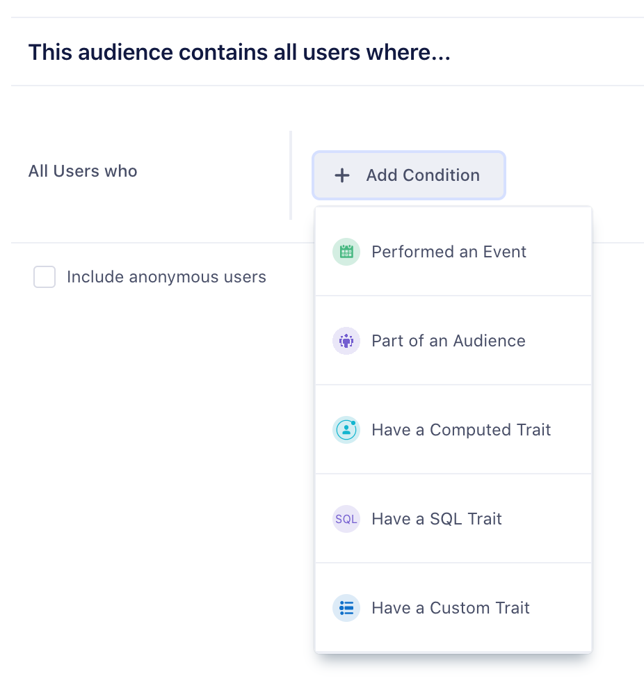
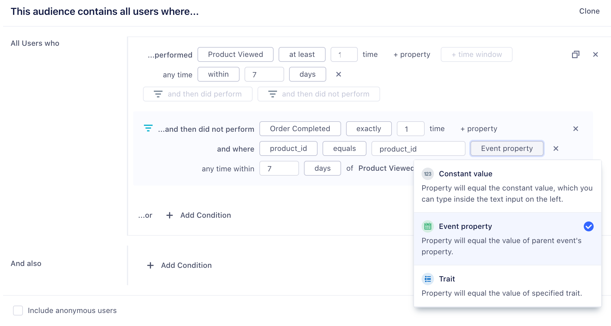
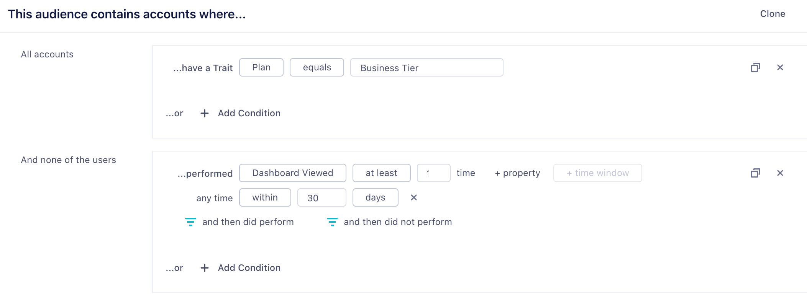
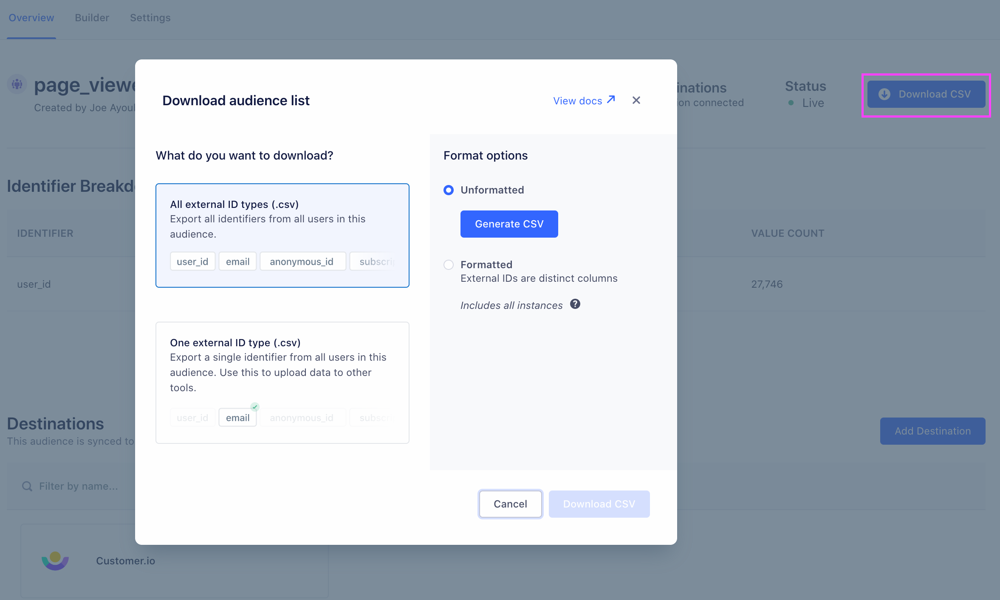

Audiences allow you to define cohorts of users or accounts based on their event behavior and traits that Segment then keeps up-to-date over time. Audiences can be built from your core **tracking events**, **traits**, or **computed traits**. These audiences can then be sycned to hundreds of destinations and are available via the [Profile API](/docs/personas/profile-api).

## Building an Audience

When building an audience you can leverage existing events, traits, computed traits or audiences.



### Events

You can build an audience from any of the events that are connected to Personas. This includes any [track](/docs/connections/spec/track), [page](/docs/connections/spec/page), or [screen](/docs/connections/spec/screen) calls. You can use the `property` button to refine the audience on specific event properties as well. Select `and not who` to indicate users that have not performed an event. For example, you might want to look at all users that have viewed a product above a certain price point, but not completed the order.


You can also specify two different types of time-windows, `within` and `in between`. Within lets you specify an event that occurred in the last `x` number of days. In-between lets you specify events that occurred over a rolling time-window in the past. A common use case is to look at all customers that were active 30 to 90 days ago, but have not completed an action in the last 30 days.

### Custom Traits

You can also build audiences based on custom traits. These traits can be collected from your apps when a user completes a form, or signs up, via an [identify](/docs/connections/spec/identify) call. You can also check out the Personas user explorer to see examples of these traits.

### Computed Traits

You can also use computed traits in an audience definition. For example, if you have created a `total_revenue` computed trait, you can use this to generate an audience of `big_spender` customers that exceed a certain threshold.


### Funnel Audiences

Funnel audiences allow you to specify strict ordering between two events. This might be the case if you want an event to happen or not happen, within a specific time window, as in the example below


### Dynamic Property References

Dynamic Property references give you more flexibility over funnel audiences. Instead of specifying a constant value in both events, like product_id = '123' for both Product Viewed and Order Completed events, you can specify that a child event references an event property of a parent event. You can also compare an event property to a trait variable.



### Account-Level audiences

If you are a B2B business, you might want to build an audience of accounts. You can leverage both account-level traits that you've sent through the [group](/docs/connections/spec/group) call, or user-level traits and events. For example, you might want to re-engage a list of at-risk accounts defined as companies which are on a business tier plan and where none of the users in that account have logged in recently. When incorporating user-level events or traits, you can specify `None of the users`, `Any users`, or `All users`.



## Connecting your Audience to a Destination

Once you have previewed your audience, you can choose to connect a destination, or simply keep the audience in Segment and download a csv. If you already have destinations setup in Segment, you can import the configuration from one of your existing sources to Personas. Note that you can only connect one destination configuration per destination type.


When you create an audience, Segment starts syncing your audience to the destinations you selected. Audiences are either sent to destinations as a boolean user-property or a user-list, depending on what the destination supports. Read more about [which destinations are supported](/docs/personas/using-personas-data/#compatible-personas-destinations) in the Personas documentation.

For account-level audiences, you have the option to send either a [group](/docs/connections/spec/group) call and/or [identify](/docs/connections/spec/identify) call. Group calls will send one event per account, whereas identify calls will send an identify call for each user in the account. This means that even if a user hasn't performed an event, we will still set the account-level computed trait on that user. Because most marketing tools are still based at the user level, it is often important to map this account-level trait onto each user within an account.

## Realtime Compute vs. Batch

Realtime Compute allows you to update traits and audiences as Segment receives new events. Realtime Compute unlocks exciting use cases:

- **Intra-Session App Personalization:** change your app experience with personalized onboarding, product recommendations, and faster funnels based on a user entering and exiting an audience.
- **Instant Messaging:** Trigger messages in email, livechat, and push notifications instantly, to deliver immediate experiences across channels.
- **Operational Workflows:** Supercharge your sales and support teams by responding to customer needs faster, based on the latest understanding of a user

To create a new audience:

1. Go to your **Computed Traits** or **Audiences** tab in Personas and click **New**.
   


2. Create your computed trait or audience.

   A lightning bolt indicates that the computation updates in real-time.

   

3. To preview your audience, click **Select Destinations**, then click **Review & Create**.

   By default, Segment queries all historical data (or "[replays](/docs/guides/what-is-replay/)" data) to set the current value of the computed trait and audience. You can uncheck Historical Backfill to compute values for the audience or trait without using this data. With this disabled, the trait or audience only uses the data that arrives after you created it.

   


> warning ""
> [Facebook Custom Audiences](/docs/connections/destinations/catalog/personas-facebook-custom-audiences/), [Marketo Lists](/docs/connections/destinations/catalog/marketo-static-lists/), and [Adwords Remarketing Lists](/docs/destinations/adwords-remarketing-lists) have rate limits on how quickly we can update an audience. We sync at the highest frequency allowed by the tool, which is between 1 hour and 6 hours.

## Accessing your Audiences via the Profiles API

You can access your audiences via the Profile API by querying the `/traits` endpoint. For example, if you can query for the `high_value_user` with the following GET request:

```
https://profiles.segment.com/v1/spaces/<workspace_id>/collections/users/profiles/email:alex@segment.com/traits?limit=100&include=high_value_user
```

returns:

```json
    {
        "traits": {
            "high_value_user": true
        },
        "cursor": {
            "url": "",
            "has_more": false,
            "next": "",
            "limit": 100
        }
    }
```
You can read the [full Profile API docs](/docs/personas/profile-api/) to learn more.

## Downloading your Audience as a CSV

You can download a copy of your audience by visiting the the audience overview page.

Audience CSVs are generated on demand. Before you can download the CSV, you will need to generate it. There are three different options for formatting:
<ul>
    <li><b>Unformatted:</b> Contains two columns. The first contains the user or account key and the second is a JSON object containing the external IDs. Generating this CSV is by far the fastest of the three options. <a id="raw-csv-a" href="files/audience_csv_format_a.csv">Download sample CSV</a></li>
    <li><b>Extract external IDs into distinct columns:</b> Contains the same first two columns as the unformatted CSV. Additional columns are added for each distinct external ID type. When a given external ID type has more than one value, for example a user with two email addresses, <i>additional indexed columns are added,</i> for example <b>email_1, email_2</b>. <a id="raw-csv-b" href="files/audience_csv_format_b.csv">Download sample CSV</a></li>
    <li><b>Expand external IDs into additional rows:</b> Contains the same first two columns as the unformatted CSV. Additional columns are added for each distinct external ID type. When a given external ID type has more than one value, for example a user with two email addresses, <i>additional rows are added with the first two columns repeated (user or account key and external IDs JSON).</i> <a id="raw-csv-c" href="files/audience_csv_format_c.csv">Download sample CSV</a></li>
</ul>
<table>
    <tr>
        <td></td>
        <td width="45%">Generating a CSV can take a substantial amount of time for large audiences (around 30 seconds for a formatted CSV with 1 million rows). For CSVs that are expected to take over 20 seconds, we present a rough estimate of generation time. After clicking "Generate", you may leave the page and return later to download the file (Note that if a more recent result for the audience has been calculated in that time, you will have to regenerate).</td>
    </tr>
</table>

