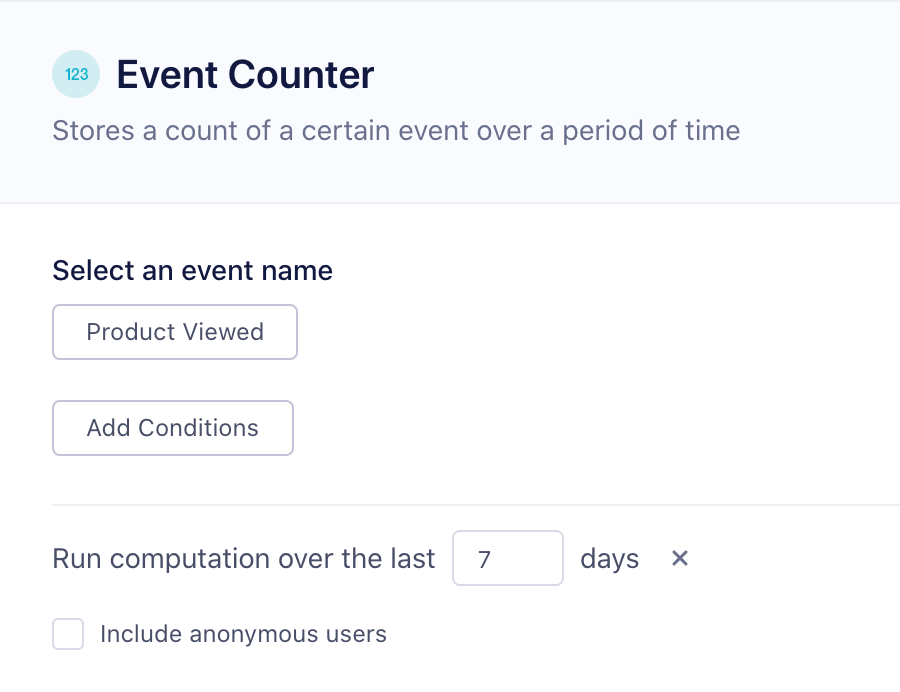
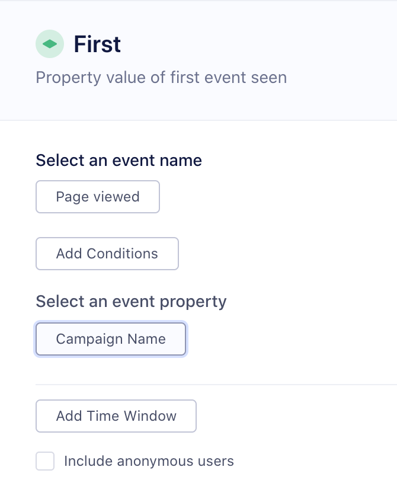
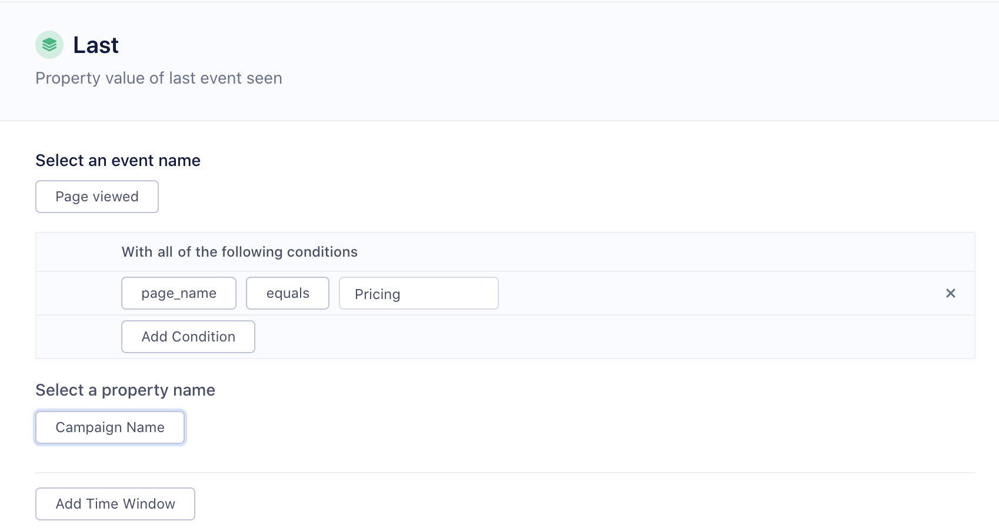
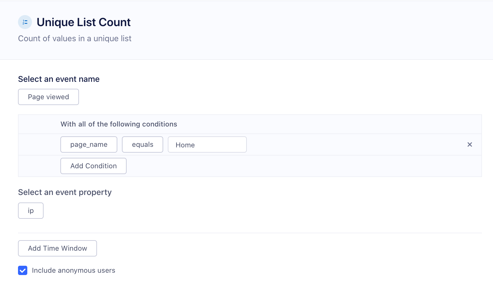
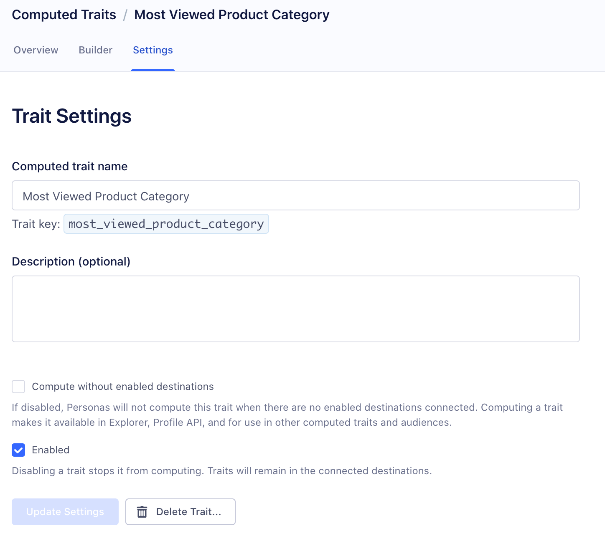
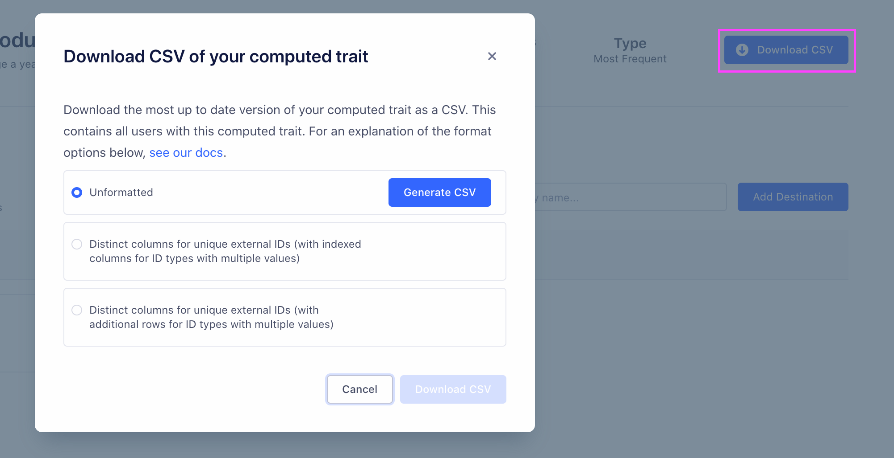
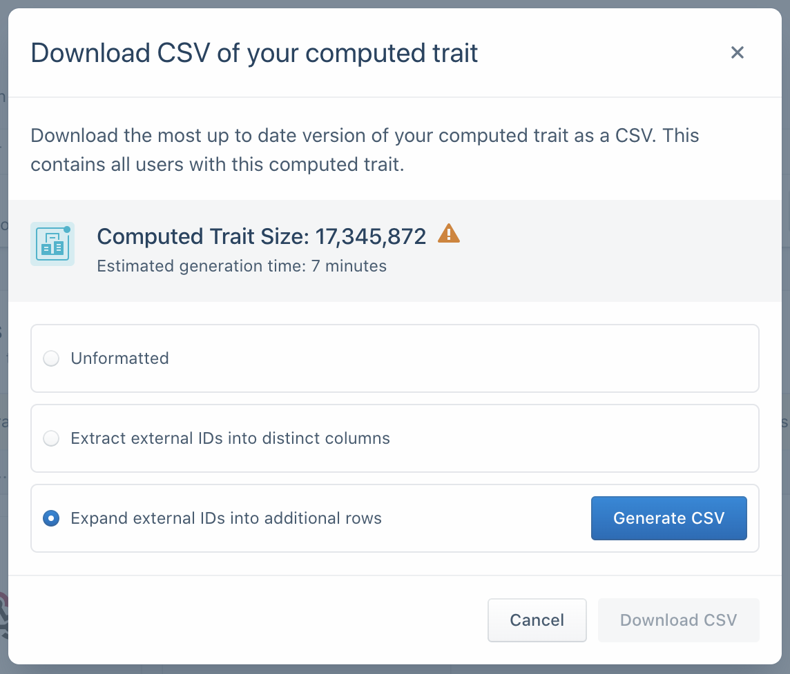

Computed Traits allow you to quickly create user or account-level calculations that Segment keeps up-to-date over time. These can be computations like the `total_num_orders` a customer has completed, the `lifetime_revenue` of a customer, the `most_frequent_user` to determine which user is most active in an account, or the `unique_visitors_count` to assess how many visitors from a single domain. These computations are based on your events and event properties that you are sending through Segment on the [page](/docs/connections/spec/page/) and [track](/docs/connections/spec/track) calls.

## Types of Computed Traits

Personas currently supports the following types of computed traits:
- [Event Counter](#event-counter)
- [Aggregation](#aggregation)
- [Most Frequent](#most-frequent)
- [First](#first)
- [Last](#last)
- [Unique List](#unique-list)
- [Unique List Count](#unique-list-count)

### Event Counter

An Event Counter trait stores a count of an **event** over a period of time. For example, you can create a trait called `number_logins_90_days` based on a `User Logged In` event. You can also use event properties to only specific types of events.

User-level examples:
- Orders Completed Last 30 Days
- Pricing Page Views Last 30 Days

Account-level examples:
- Total Logins by Account 30 Days
- Emails Opened by Account 90 Days



### Aggregation

An aggregation computes a **sum, average, minimum, or maximum** of a numeric **event property**. A good example is a `sum_cosmetics_revenue_90_days` if you're sending an `Order Completed` event with a `revenue` property. In the example we're refining the revenue even further based on another event property: `category = 'cosmetics'`. Note that you can only compute an aggregation trait for event properties that have a numeric value.

User-level examples:
- Order Revenue Last 14 Days
- Max Ride Distance Last 60 Days

Account-level use cases
- Total Minutes Watched 30 Days
- Avg Order Size Last 180 Days


### Most Frequent

A most frequent user-level computed trait will return the **most common value** for an **event property**.  This is  helpful to create traits like `preferred_product_viewed`  or `most_commonly_viewed_category` that tell you what a user's preferred product, or content category might be. Note that the most frequent computed trait requires the event property to have been tracked at least twice. In the case of a tie, we return the first alphabetical value. For account-level computed traits, you can also return the most frequent **user trait**. This is helpful when you want to determine which user has performed an event the most frequently. For example, you might to return the email of the user in an account most actively viewing your app.

User-level examples:
- Favorite Blog Post
- Top Purchase Category


Account-level examples:
- Most frequent product viewed
- Most active user


### First

The first user-level trait returns the first event property value we have seen. This is common for creating traits like `first_page_visited` based on the page name. For accounts, the first computed trait could also return a trait like `first_user_signup`, to calculate the first user to use your product.

User-level examples:
- First seen timestamp
- First utm parameter

Account-level examples:
- First email opened
- First user signup



### Last

The last trait returns the last event property value we have seen. This is common for creating traits like `last_utm_campaign` to help you calculate last-touch attribution for paid advertising.

User-level examples:
- Last seen at
- Last utm parameter


Account-level examples:
- Last unsubscribe timestamp
- Last user active



### Unique List

Unique list computed traits will output a **list of unique values** for an **event property**. This is helpful to understand the different types of products or content that a customer or users in an account have interacted with or purchased. Customers are creating traits like `unique_product_categories_viewed` and sending them to email marketing tools and accessing them through the Profiles API for in-app personalization.

Example use cases:
- Unique products purchased
- Unique categories
- Unique games played


### Unique List Count

Unique list count computed traits will output a **count of the unique list of values** for an **event property**. Customers are creating traits like `unique_product_categories_viewed_count` to understand the variety of products that a customer is viewing. At the account-level, customers are creating traits like `unique_visitors_count` to calculate the number of unique visitors by ip address.

User-level examples:
- Unique products viewed count
- Unique categories count


Account-level examples:
- Unique products viewed
- Unique visitors count



## Conditions

All computed trait types support a common "Add Conditions" section. Conditions defined here restrict the messages considered when calculating the final value of the computed trait by looking at a property of the events. For example, you could limits events to only those where "price" is greater than 30.00 or where "page.url" contains "pricing".

The following operators are available.
- equals
- not equals -
- less than
- greater than
- less than or equal
- greater than or equal
- contains
- does not contain
- starts with
- ends with
- exists
- not exists
- before date
- after date
- within last (x days)
- with next (x days)
- before last (x days)
- after next (x days)

## Connecting your Computed Trait to a Destination

User-level computed Traits are sent to destinations on our platform through the [identify](/docs/connections/spec/identify/) call as a user trait. The trait name will correspond to the snake-cased name that you can find in the trait settings, for e.g. `most_viewed_page_category`. You can find the list of destinations [here](/docs/personas/using-personas-data/#compatible-personas-destinations)



For account-level computed traits, you have the option to send either a [group](/docs/connections/spec/group/) call and/or [identify](/docs/connections/spec/identify/) call. Group calls will send one event per account, whereas identify calls will send an identify call for each user in the account. This means that even if a user hasn't performed an event, we will still set the account-level computed trait on that user. Because most marketing tools are still based at the user level, it is often important to map this account-level trait onto each user within an account.

## Accessing your Computed Traits via the Profiles API

You can access your computed traits via the Profile API by querying the `/traits` endpoint. For example, if you can query for the `emails_opened_last_30_days` with the following GET request:

```
https://profiles.segment.com/v1/spaces/<workspace_id>/collections/users/profiles/email:john.doe@segment.com/traits?include=emails_opened_last_30_days
```

returns:
```json
    {
        "traits": {
            "emails_opened_last_30_days": 255
        },
        "cursor": {
            "url": "",
            "has_more": false,
            "next": "",
            "limit": 100
        }
    }
```

You can read the [full Profile API docs](/docs/personas/profile-api/) to learn more.

## Downloading your Computed Trait as a CSV

You can download a copy of your trait by visiting the the computed trait overview page.

Computed Trait CSVs are generated on demand. Before you can download the CSV, you will need to generate it. There are three different options for formatting:
- **Unformatted:** Contains three columns. The first contains the user or account key, the second contains the trait value and the third is a JSON object containing the external IDs. Generating this CSV is by far the fastest of the three options. <a id="raw-csv-a" href="files/trait_csv_format_a.csv">Download sample CSV</a>
- **Extract external IDs into distinct columns:** Contains the same first three columns as the unformatted CSV. Additional columns are added for each distinct external ID type. When a single row has more than one value for a given external ID type, for example a user with two email addresses <i>additional indexed columns are added,</i> for example **email_1, email_2**. <a id="raw-csv-b" href="files/trait_csv_format_b.csv">Download sample CSV</a>
- **Expand external IDs into additional rows:** Contains the same first three columns as the unformatted CSV. Additional columns are added for each distinct external ID type. When a single row has more than one value for a given external ID type, for example a user with two email addresses, <i>additional rows are added with the first three columns repeated (user or account key, trait value and external IDs JSON).</i> <a id="raw-csv-c" href="files/trait_csv_format_c.csv">Download sample CSV</a>
<table>
    <tr>
        <td></td>
        <td width="45%">Generating a CSV can take a substantial amount of time for large traits (around 30 seconds for a formatted CSV with 1 million rows). For CSVs that are expected to take over 20 seconds, we present a rough estimate of generation time. After clicking "Generate", you may leave the page and return later to download the file (Note that if a more recent result for the trait has been calculated in that time, you will have to regenerate).</td>
    </tr>
</table>