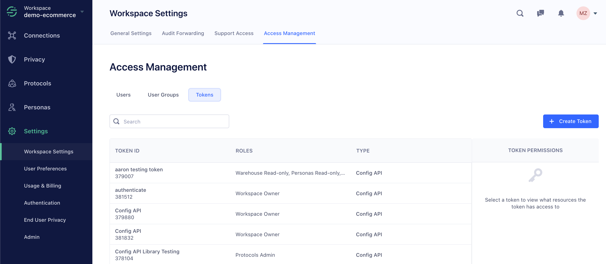

## Team Members

A Segment *Team Member* is an individual with access to a workspace. A Segment user can be associated with one or more workspaces, either as an `owner` or `member` of each.
Check out the [roles documentation](/docs/segment-app/iam/roles) for a complete list of roles.

## User Groups

A *User Group* is a set of Team Members with a set of shared policies. A Segment Team Member can be a member of one or many Groups. All roles in the Segment App are additive, which means that group membership can be assigned in addition to individual roles for a single team member. For example, a single user could inherit roles from a Group definition AND have access to additional resources through individually assigned roles.

## Tokens

You can generate tokens to programmatically access Segment resources using the [Segment Public API](/docs/api/public-api).

## Resources

Resources are the building blocks of Segment, and represent the different parts of your Segment deployment to which you can grant access. These include:

- Workspaces
- Sources
- Destinations
- Warehouses
- Spaces
- Protocols Tracking Plans

## Labels

Workspace owners can use Labels to grant users access to groups of resources. When you add a Label to a Source or Spaces, any users who are granted access to that Label gain access to those resources.

To create or configure labels, go to the **Labels** tab in your workspace settings. Only workspace Owners can manage labels for the entire workspace.

### Quick Links:

- [Label-based Access Management](/docs/segment-app/iam/labels/)
- [Labels Best Practices](/docs/segment-app/iam/labels/)
